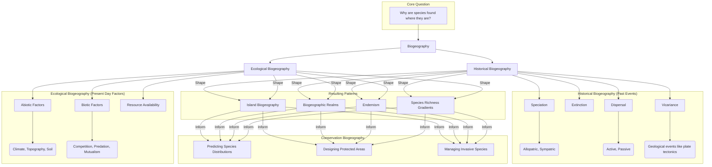

```mermaid
flowchart TD
    subgraph "Core Question"
        Q[Why are species found where they are?]
    end

    Q --> B[Biogeography]

    subgraph "Ecological Biogeography (Present Day Factors)"
        E1[Abiotic Factors] --> E1a(Climate, Topography, Soil)
        E2[Biotic Factors] --> E2a(Competition, Predation, Mutualism)
        E3[Resource Availability]
    end

    B --> EB[Ecological Biogeography]
    EB --> E1 & E2 & E3

    subgraph "Historical Biogeography (Past Events)"
        H1[Speciation] --> H1a(Allopatric, Sympatric)
        H2[Extinction]
        H3[Dispersal] --> H3a(Active, Passive)
        H4[Vicariance] --> H4a(Geological events like plate tectonics)
    end

    B --> HB[Historical Biogeography]
    HB --> H1 & H2 & H3 & H4

    subgraph "Resulting Patterns"
        P1[Species Richness Gradients]
        P2[Endemism]
        P3[Biogeographic Realms]
        P4[Island Biogeography]
    end

    EB & HB -- Shape --> P1 & P2 & P3 & P4

    subgraph "Conservation Biogeography"
        CB1[Predicting Species Distributions]
        CB2[Designing Protected Areas]
        CB3[Managing Invasive Species]
    end

    P1 & P2 & P3 & P4 -- Inform --> CB1 & CB2 & CB3
```
