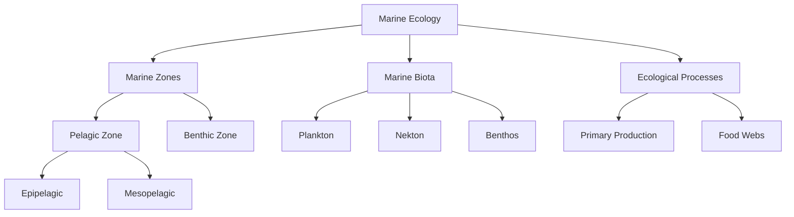

```mermaid
flowchart TD
    MarineEcology[Marine Ecology] --> Zones[Marine Zones]
    MarineEcology --> Biota[Marine Biota]
    MarineEcology --> Processes[Ecological Processes]
    Zones --> Pelagic[Pelagic Zone]
    Zones --> Benthic[Benthic Zone]
    Pelagic --> Epipelagic[Epipelagic]
    Pelagic --> Mesopelagic[Mesopelagic]
    Biota --> Plankton[Plankton]
    Biota --> Nekton[Nekton]
    Biota --> Benthos[Benthos]
    Processes --> Production[Primary Production]
    Processes --> FoodWebs[Food Webs]
```