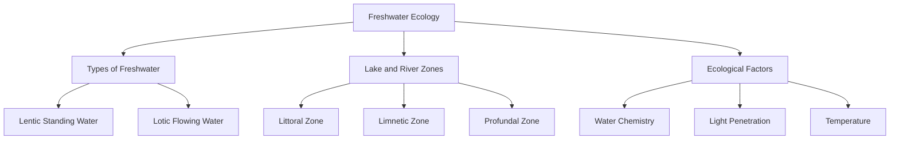

```mermaid
flowchart TD
    FreshwaterEcology[Freshwater Ecology] --> Types[Types of Freshwater]
    FreshwaterEcology --> Zones[Lake and River Zones]
    FreshwaterEcology --> Factors[Ecological Factors]
    Types --> Lentic[Lentic Standing Water]
    Types --> Lotic[Lotic Flowing Water]
    Zones --> Littoral[Littoral Zone]
    Zones --> Limnetic[Limnetic Zone]
    Zones --> Profundal[Profundal Zone]
    Factors --> Chemistry[Water Chemistry]
    Factors --> Light[Light Penetration]
    Factors --> Temperature[Temperature]
```