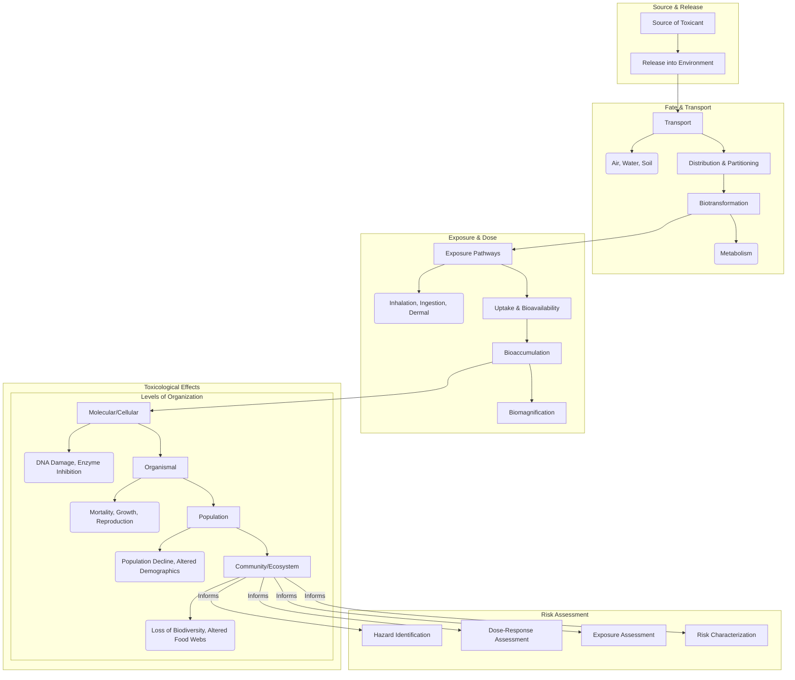

```mermaid
flowchart TD
    subgraph "Source & Release"
        S[Source of Toxicant]
        R[Release into Environment]
    end

    S --> R

    subgraph "Fate & Transport"
        T[Transport] --> T1(Air, Water, Soil)
        D[Distribution & Partitioning]
        B[Biotransformation] --> B1(Metabolism)
    end

    R --> T --> D --> B

    subgraph "Exposure & Dose"
        E[Exposure Pathways] --> E1(Inhalation, Ingestion, Dermal)
        U[Uptake & Bioavailability]
        Bio[Bioaccumulation] --> Biom[Biomagnification]
    end

    B --> E --> U --> Bio

    subgraph "Toxicological Effects"
        subgraph "Levels of Organization"
            L1[Molecular/Cellular] --> L1a(DNA Damage, Enzyme Inhibition)
            L2[Organismal] --> L2a(Mortality, Growth, Reproduction)
            L3[Population] --> L3a(Population Decline, Altered Demographics)
            L4[Community/Ecosystem] --> L4a(Loss of Biodiversity, Altered Food Webs)
        end
    end

    Bio --> L1 --> L2 --> L3 --> L4

    subgraph "Risk Assessment"
        RA1[Hazard Identification]
        RA2[Dose-Response Assessment]
        RA3[Exposure Assessment]
        RA4[Risk Characterization]
    end

    L4 -- Informs --> RA1 & RA2 & RA3 & RA4
```
