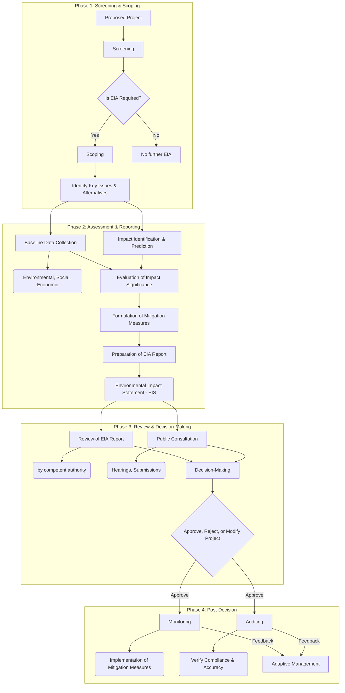

```mermaid
flowchart TD
    subgraph "Phase 1: Screening & Scoping"
        P[Proposed Project]
        S1[Screening] --> S1a{Is EIA Required?}
        S1a -- Yes --> S2[Scoping]
        S1a -- No --> End[No further EIA]
        S2 --> S2a(Identify Key Issues & Alternatives)
    end

    P --> S1

    subgraph "Phase 2: Assessment & Reporting"
        A1[Baseline Data Collection] --> A1a(Environmental, Social, Economic)
        A2[Impact Identification & Prediction]
        A3[Evaluation of Impact Significance]
        A4[Formulation of Mitigation Measures]
        A5[Preparation of EIA Report] --> A5a(Environmental Impact Statement - EIS)
    end

    S2a --> A1 & A2
    A1 & A2 --> A3 --> A4 --> A5

    subgraph "Phase 3: Review & Decision-Making"
        R1[Review of EIA Report] --> R1a(by competent authority)
        R2[Public Consultation] --> R2a(Hearings, Submissions)
        R3[Decision-Making] --> R3a{Approve, Reject, or Modify Project}
    end

    A5a --> R1 & R2
    R1 & R2 --> R3

    subgraph "Phase 4: Post-Decision"
        PD1[Monitoring] --> PD1a(Implementation of Mitigation Measures)
        PD2[Auditing] --> PD2a(Verify Compliance & Accuracy)
        PD3[Adaptive Management]
    end

    R3a -- Approve --> PD1 & PD2
    PD1 & PD2 -- Feedback --> PD3
```
