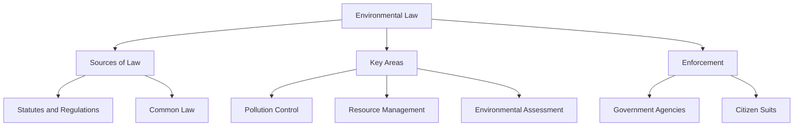

```mermaid
flowchart TD
    EnvironmentalLaw[Environmental Law] --> Sources[Sources of Law]
    EnvironmentalLaw --> Areas[Key Areas]
    EnvironmentalLaw --> Enforcement[Enforcement]
    Sources --> Statutes[Statutes and Regulations]
    Sources --> CommonLaw[Common Law]
    Areas --> Pollution[Pollution Control]
    Areas --> Resources[Resource Management]
    Areas --> Assessment[Environmental Assessment]
    Enforcement --> Agencies[Government Agencies]
    Enforcement --> CitizenSuits[Citizen Suits]
```