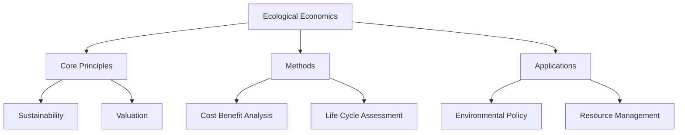

```mermaid
flowchart TD
    EcologicalEconomics[Ecological Economics] --> Principles[Core Principles]
    EcologicalEconomics --> Methods[Methods]
    EcologicalEconomics --> Applications[Applications]
    Principles --> Sustainability[Sustainability]
    Principles --> Valuation[Valuation]
    Methods --> CostBenefit[Cost Benefit Analysis]
    Methods --> LifeCycle[Life Cycle Assessment]
    Applications --> Policy[Environmental Policy]
    Applications --> Management[Resource Management]
```