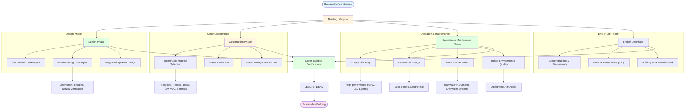

```mermaid
flowchart TD
    Start([Sustainable Architecture]) --> LC[Building Lifecycle]
    
    LC --> Design[Design Phase]
    LC --> Construction[Construction Phase]
    LC --> Operation[Operation & Maintenance Phase]
    LC --> EndOfLife[End-of-Life Phase]
    
    Design --> D1[Site Selection & Analysis]
    Design --> D2[Passive Design Strategies]
    Design --> D3[Integrated Systems Design]
    
    D2 --> D2a[Orientation, Shading, Natural Ventilation]
    
    Construction --> C1[Sustainable Material Selection]
    Construction --> C2[Waste Reduction]
    Construction --> C3[Water Management on Site]
    
    C1 --> C1a[Recycled, Reused, Local, Low-VOC Materials]
    
    Operation --> O1[Energy Efficiency]
    Operation --> O2[Renewable Energy]
    Operation --> O3[Water Conservation]
    Operation --> O4[Indoor Environmental Quality]
    
    O1 --> O1a[High-performance HVAC, LED Lighting]
    O2 --> O2a[Solar Panels, Geothermal]
    O3 --> O3a[Rainwater Harvesting, Greywater Systems]
    O4 --> O4a[Daylighting, Air Quality]
    
    EndOfLife --> E1[Deconstruction & Disassembly]
    EndOfLife --> E2[Material Reuse & Recycling]
    EndOfLife --> E3[Building as a Material Bank]
    
    Design --> Cert[Green Building Certifications]
    Construction --> Cert
    Operation --> Cert
    EndOfLife --> Cert
    
    Cert --> Cert1[LEED, BREEAM]
    
    Cert1 --> End([Sustainable Building])
    
    subgraph Design_Phase["Design Phase"]
        Design
        D1
        D2
        D3
    end
    
    subgraph Construction_Phase["Construction Phase"]
        Construction
        C1
        C2
        C3
    end
    
    subgraph Operation_Phase["Operation & Maintenance"]
        Operation
        O1
        O2
        O3
        O4
    end
    
    subgraph End_of_Life["End-of-Life Phase"]
        EndOfLife
        E1
        E2
        E3
    end
    
    style Start fill:#e1f5ff
    style End fill:#ffe1f5
    style LC fill:#fff4e1
    style Design fill:#e1ffe1
    style Construction fill:#fff4e1
    style Operation fill:#e1ffe1
    style Cert fill:#e1ffe1
```
