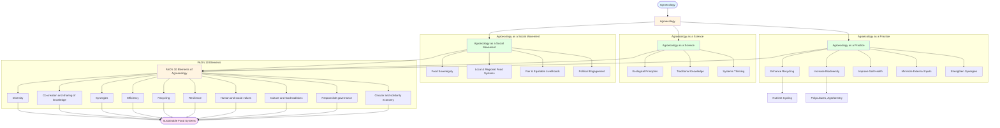

```mermaid
flowchart TD
    Start([Agroecology]) --> AE[Agroecology]
    
    AE --> Science[Agroecology as a Science]
    AE --> Practice[Agroecology as a Practice]
    AE --> Movement[Agroecology as a Social Movement]
    
    Science --> S1[Ecological Principles]
    Science --> S2[Traditional Knowledge]
    Science --> S3[Systems Thinking]
    
    Practice --> P1[Enhance Recycling]
    Practice --> P2[Increase Biodiversity]
    Practice --> P3[Improve Soil Health]
    Practice --> P4[Minimize External Inputs]
    Practice --> P5[Strengthen Synergies]
    
    P1 --> P1a[Nutrient Cycling]
    P2 --> P2a[Polycultures, Agroforestry]
    
    Movement --> M1[Food Sovereignty]
    Movement --> M2[Local & Regional Food Systems]
    Movement --> M3[Fair & Equitable Livelihoods]
    Movement --> M4[Political Engagement]
    
    Science --> Elements[FAO's 10 Elements of Agroecology]
    Practice --> Elements
    Movement --> Elements
    
    Elements --> E1[Diversity]
    Elements --> E2[Co-creation and sharing of knowledge]
    Elements --> E3[Synergies]
    Elements --> E4[Efficiency]
    Elements --> E5[Recycling]
    Elements --> E6[Resilience]
    Elements --> E7[Human and social values]
    Elements --> E8[Culture and food traditions]
    Elements --> E9[Responsible governance]
    Elements --> E10[Circular and solidarity economy]
    
    E1 --> End([Sustainable Food Systems])
    E2 --> End
    E3 --> End
    E4 --> End
    E5 --> End
    E6 --> End
    E7 --> End
    E8 --> End
    E9 --> End
    E10 --> End
    
    subgraph Science_Group["Agroecology as a Science"]
        Science
        S1
        S2
        S3
    end
    
    subgraph Practice_Group["Agroecology as a Practice"]
        Practice
        P1
        P2
        P3
        P4
        P5
    end
    
    subgraph Movement_Group["Agroecology as a Social Movement"]
        Movement
        M1
        M2
        M3
        M4
    end
    
    subgraph Elements_Group["FAO's 10 Elements"]
        Elements
        E1
        E2
        E3
        E4
        E5
        E6
        E7
        E8
        E9
        E10
    end
    
    style Start fill:#e1f5ff
    style End fill:#ffe1f5
    style AE fill:#fff4e1
    style Science fill:#e1ffe1
    style Practice fill:#e1ffe1
    style Movement fill:#e1ffe1
    style Elements fill:#fff4e1
```
