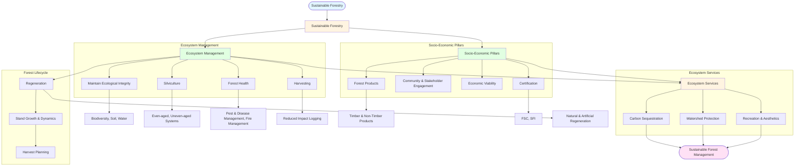

```mermaid
flowchart TD
    Start([Sustainable Forestry]) --> SF[Sustainable Forestry]
    
    SF --> EM[Ecosystem Management]
    SF --> SP[Socio-Economic Pillars]
    
    EM --> P1[Maintain Ecological Integrity]
    EM --> P2[Silviculture]
    EM --> P3[Forest Health]
    EM --> P4[Harvesting]
    
    P1 --> P1a[Biodiversity, Soil, Water]
    P2 --> P2a[Even-aged, Uneven-aged Systems]
    P3 --> P3a[Pest & Disease Management, Fire Management]
    P4 --> P4a[Reduced Impact Logging]
    
    SP --> S1[Forest Products]
    SP --> S2[Community & Stakeholder Engagement]
    SP --> S3[Economic Viability]
    SP --> S4[Certification]
    
    S1 --> S1a[Timber & Non-Timber Products]
    S4 --> S4a[FSC, SFI]
    
    EM --> Regen[Regeneration]
    Regen --> Growth[Stand Growth & Dynamics]
    Growth --> Harvest[Harvest Planning]
    
    Regen --> Regen_a[Natural & Artificial Regeneration]
    
    EM --> ES[Ecosystem Services]
    SP --> ES
    
    ES --> ES1[Carbon Sequestration]
    ES --> ES2[Watershed Protection]
    ES --> ES3[Recreation & Aesthetics]
    
    ES1 --> End([Sustainable Forest Management])
    ES2 --> End
    ES3 --> End
    
    subgraph Ecosystem_Mgmt["Ecosystem Management"]
        EM
        P1
        P2
        P3
        P4
    end
    
    subgraph Socio_Economic["Socio-Economic Pillars"]
        SP
        S1
        S2
        S3
        S4
    end
    
    subgraph Lifecycle["Forest Lifecycle"]
        Regen
        Growth
        Harvest
    end
    
    subgraph Services["Ecosystem Services"]
        ES
        ES1
        ES2
        ES3
    end
    
    style Start fill:#e1f5ff
    style End fill:#ffe1f5
    style SF fill:#fff4e1
    style EM fill:#e1ffe1
    style SP fill:#e1ffe1
    style ES fill:#fff4e1
```
