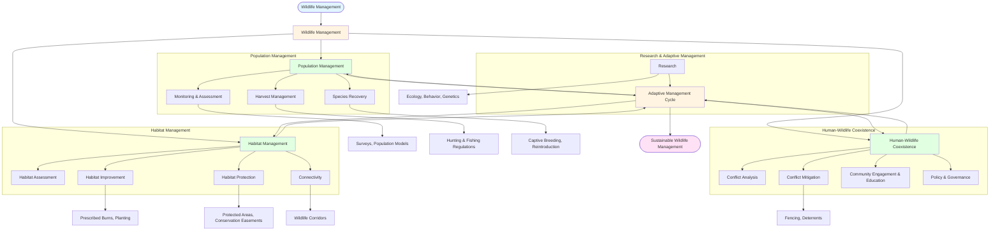

```mermaid
flowchart TD
    Start([Wildlife Management]) --> WM[Wildlife Management]
    
    WM --> PM[Population Management]
    WM --> HM[Habitat Management]
    WM --> HWC[Human-Wildlife Coexistence]
    
    PM --> P1[Monitoring & Assessment]
    PM --> P2[Harvest Management]
    PM --> P3[Species Recovery]
    
    P1 --> P1a[Surveys, Population Models]
    P2 --> P2a[Hunting & Fishing Regulations]
    P3 --> P3a[Captive Breeding, Reintroduction]
    
    HM --> H1[Habitat Assessment]
    HM --> H2[Habitat Improvement]
    HM --> H3[Habitat Protection]
    HM --> H4[Connectivity]
    
    H2 --> H2a[Prescribed Burns, Planting]
    H3 --> H3a[Protected Areas, Conservation Easements]
    H4 --> H4a[Wildlife Corridors]
    
    HWC --> C1[Conflict Analysis]
    HWC --> C2[Conflict Mitigation]
    HWC --> C3[Community Engagement & Education]
    HWC --> C4[Policy & Governance]
    
    C2 --> C2a[Fencing, Deterrents]
    
    R[Research] --> R1[Ecology, Behavior, Genetics]
    R --> AM[Adaptive Management Cycle]
    
    PM --> AM
    HM --> AM
    HWC --> AM
    
    AM --> PM
    AM --> HM
    AM --> HWC
    
    AM --> End([Sustainable Wildlife Management])
    
    subgraph Population_Mgmt["Population Management"]
        PM
        P1
        P2
        P3
    end
    
    subgraph Habitat_Mgmt["Habitat Management"]
        HM
        H1
        H2
        H3
        H4
    end
    
    subgraph Human_Wildlife["Human-Wildlife Coexistence"]
        HWC
        C1
        C2
        C3
        C4
    end
    
    subgraph Research_Adaptive["Research & Adaptive Management"]
        R
        AM
    end
    
    style Start fill:#e1f5ff
    style End fill:#ffe1f5
    style WM fill:#fff4e1
    style PM fill:#e1ffe1
    style HM fill:#e1ffe1
    style HWC fill:#e1ffe1
    style AM fill:#fff4e1
```
