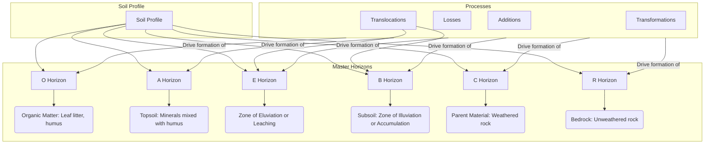

```mermaid
flowchart TD
    subgraph "Soil Profile"
        SP[Soil Profile]
    end

    SP --> O & A & E & B & C & R

    subgraph "Master Horizons"
        O[O Horizon] --> O1(Organic Matter: Leaf litter, humus)
        A[A Horizon] --> A1(Topsoil: Minerals mixed with humus)
        E[E Horizon] --> E1(Zone of Eluviation or Leaching)
        B[B Horizon] --> B1(Subsoil: Zone of Illuviation or Accumulation)
        C[C Horizon] --> C1(Parent Material: Weathered rock)
        R[R Horizon] --> R1(Bedrock: Unweathered rock)
    end

    subgraph "Processes"
        P1[Additions]
        P2[Losses]
        P3[Translocations]
        P4[Transformations]
    end

    Processes -- Drive formation of --> O & A & E & B & C & R

    P3 --> E
    P3 --> B
```
