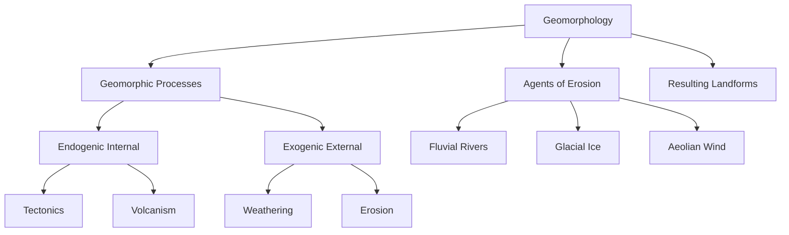

```mermaid
flowchart TD
    Geomorphology[Geomorphology] --> Processes[Geomorphic Processes]
    Geomorphology --> Agents[Agents of Erosion]
    Geomorphology --> Landforms[Resulting Landforms]
    Processes --> Endogenic[Endogenic Internal]
    Processes --> Exogenic[Exogenic External]
    Endogenic --> Tectonics[Tectonics]
    Endogenic --> Volcanism[Volcanism]
    Exogenic --> Weathering[Weathering]
    Exogenic --> Erosion[Erosion]
    Agents --> Fluvial[Fluvial Rivers]
    Agents --> Glacial[Glacial Ice]
    Agents --> Aeolian[Aeolian Wind]
```