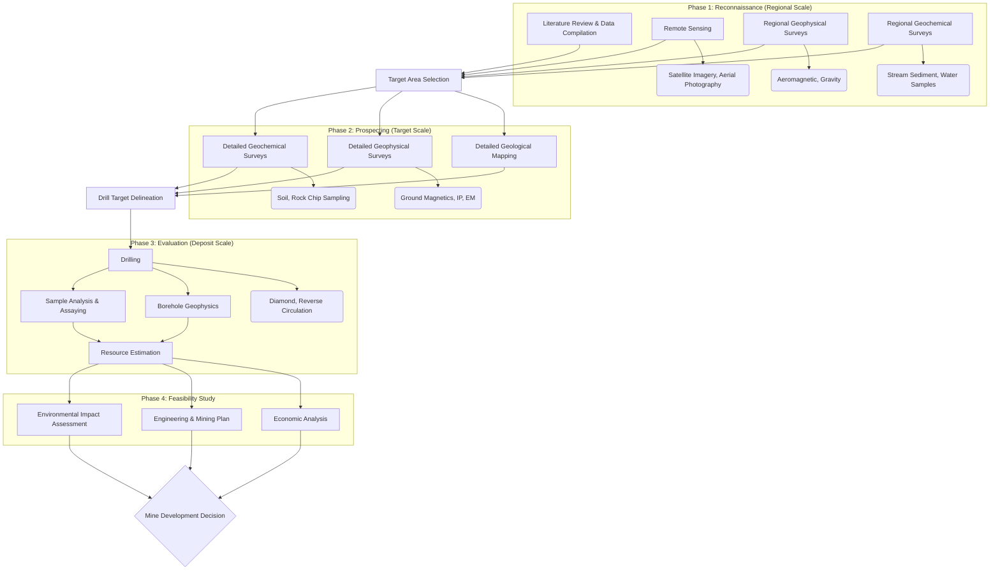

```mermaid
flowchart TD
    subgraph "Phase 1: Reconnaissance (Regional Scale)"
        R1[Literature Review & Data Compilation]
        R2[Remote Sensing] --> R2a(Satellite Imagery, Aerial Photography)
        R3[Regional Geophysical Surveys] --> R3a(Aeromagnetic, Gravity)
        R4[Regional Geochemical Surveys] --> R4a(Stream Sediment, Water Samples)
    end

    R1 & R2 & R3 & R4 --> T1[Target Area Selection]

    subgraph "Phase 2: Prospecting (Target Scale)"
        P1[Detailed Geological Mapping]
        P2[Detailed Geophysical Surveys] --> P2a(Ground Magnetics, IP, EM)
        P3[Detailed Geochemical Surveys] --> P3a(Soil, Rock Chip Sampling)
    end

    T1 --> P1 & P2 & P3

    P1 & P2 & P3 --> T2[Drill Target Delineation]

    subgraph "Phase 3: Evaluation (Deposit Scale)"
        E1[Drilling] --> E1a(Diamond, Reverse Circulation)
        E2[Borehole Geophysics]
        E3[Sample Analysis & Assaying]
        E4[Resource Estimation]
    end

    T2 --> E1 --> E2 & E3 --> E4

    subgraph "Phase 4: Feasibility Study"
        FS1[Economic Analysis]
        FS2[Engineering & Mining Plan]
        FS3[Environmental Impact Assessment]
    end

    E4 --> FS1 & FS2 & FS3

    FS1 & FS2 & FS3 --> Decision{Mine Development Decision}
```
