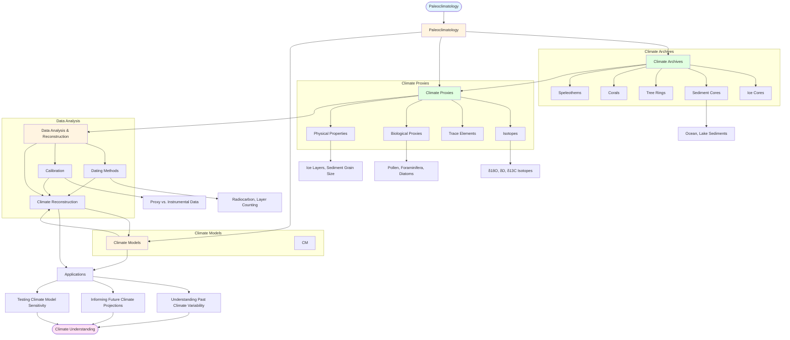

```mermaid
flowchart TD
    Start([Paleoclimatology]) --> PC[Paleoclimatology]
    
    PC --> Archives[Climate Archives]
    PC --> Proxies[Climate Proxies]
    PC --> Models[Climate Models]
    
    Archives --> A1[Ice Cores]
    Archives --> A2[Sediment Cores]
    Archives --> A3[Tree Rings]
    Archives --> A4[Corals]
    Archives --> A5[Speleothems]
    
    A2 --> A2a[Ocean, Lake Sediments]
    
    Proxies --> P1[Isotopes]
    Proxies --> P2[Trace Elements]
    Proxies --> P3[Biological Proxies]
    Proxies --> P4[Physical Properties]
    
    P1 --> P1a[δ18O, δD, δ13C Isotopes]
    P3 --> P3a[Pollen, Foraminifera, Diatoms]
    P4 --> P4a[Ice Layers, Sediment Grain Size]
    
    Archives --> Proxies
    
    Proxies --> Analysis[Data Analysis & Reconstruction]
    
    Analysis --> D1[Dating Methods]
    Analysis --> D2[Calibration]
    Analysis --> D3[Climate Reconstruction]
    
    D1 --> D1a[Radiocarbon, Layer Counting]
    D2 --> D2a[Proxy vs. Instrumental Data]
    
    D1 --> D3
    D2 --> D3
    
    D3 --> Models
    Models --> D3
    
    D3 --> Applications[Applications]
    Models --> Applications
    
    Applications --> App1[Understanding Past Climate Variability]
    Applications --> App2[Informing Future Climate Projections]
    Applications --> App3[Testing Climate Model Sensitivity]
    
    App1 --> End([Climate Understanding])
    App2 --> End
    App3 --> End
    
    subgraph Archives_Group["Climate Archives"]
        Archives
        A1
        A2
        A3
        A4
        A5
    end
    
    subgraph Proxies_Group["Climate Proxies"]
        Proxies
        P1
        P2
        P3
        P4
    end
    
    subgraph Analysis_Group["Data Analysis"]
        Analysis
        D1
        D2
        D3
    end
    
    subgraph Models_Group["Climate Models"]
        Models
        CM
    end
    
    style Start fill:#e1f5ff
    style End fill:#ffe1f5
    style PC fill:#fff4e1
    style Archives fill:#e1ffe1
    style Proxies fill:#e1ffe1
    style Analysis fill:#fff4e1
    style Models fill:#fff4e1
```
