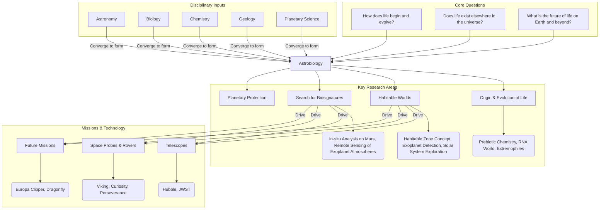

```mermaid
flowchart TD
    subgraph "Core Questions"
        Q1[How does life begin and evolve?]
        Q2[Does life exist elsewhere in the universe?]
        Q3[What is the future of life on Earth and beyond?]
    end

    Q1 & Q2 & Q3 --> A[Astrobiology]

    subgraph "Key Research Areas"
        RA1[Origin & Evolution of Life] --> RA1a(Prebiotic Chemistry, RNA World, Extremophiles)
        RA2[Habitable Worlds] --> RA2a(Habitable Zone Concept, Exoplanet Detection, Solar System Exploration)
        RA3[Search for Biosignatures] --> RA3a(In-situ Analysis on Mars, Remote Sensing of Exoplanet Atmospheres)
        RA4[Planetary Protection]
    end

    A --> RA1 & RA2 & RA3 & RA4

    subgraph "Disciplinary Inputs"
        D1[Astronomy]
        D2[Biology]
        D3[Chemistry]
        D4[Geology]
        D5[Planetary Science]
    end

    D1 & D2 & D3 & D4 & D5 -- Converge to form --> A

    subgraph "Missions & Technology"
        M1[Telescopes] --> M1a(Hubble, JWST)
        M2[Space Probes & Rovers] --> M2a(Viking, Curiosity, Perseverance)
        M3[Future Missions] --> M3a(Europa Clipper, Dragonfly)
    end

    RA2 & RA3 -- Drive --> M1 & M2 & M3
```
