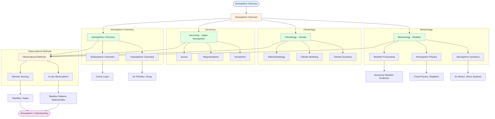

```mermaid
flowchart TD
    Start([Atmospheric Sciences]) --> AS[Atmospheric Sciences]
    
    AS --> Met[Meteorology - Weather]
    AS --> Clim[Climatology - Climate]
    AS --> Aero[Aeronomy - Upper Atmosphere]
    AS --> Chem[Atmospheric Chemistry]
    
    Met --> M1[Atmospheric Dynamics]
    Met --> M2[Atmospheric Physics]
    Met --> M3[Weather Forecasting]
    
    M1 --> M1a[Air Motion, Storm Systems]
    M2 --> M2a[Cloud Physics, Radiation]
    M3 --> M3a[Numerical Weather Prediction]
    
    Clim --> C1[Climate Dynamics]
    Clim --> C2[Climate Modeling]
    Clim --> C3[Paleoclimatology]
    
    Aero --> A1[Ionosphere]
    Aero --> A2[Magnetosphere]
    Aero --> A3[Aurora]
    
    Chem --> AC1[Tropospheric Chemistry]
    Chem --> AC2[Stratospheric Chemistry]
    
    AC1 --> AC1a[Air Pollution, Smog]
    AC2 --> AC2a[Ozone Layer]
    
    Met --> Observations[Observational Methods]
    Clim --> Observations
    Aero --> Observations
    Chem --> Observations
    
    Observations --> O1[In-situ Observations]
    Observations --> O2[Remote Sensing]
    
    O1 --> O1a[Weather Stations, Radiosondes]
    O2 --> O2a[Satellites, Radar]
    
    O1a --> End([Atmospheric Understanding])
    O2a --> End
    
    subgraph Meteorology["Meteorology"]
        Met
        M1
        M2
        M3
    end
    
    subgraph Climatology["Climatology"]
        Clim
        C1
        C2
        C3
    end
    
    subgraph Aeronomy["Aeronomy"]
        Aero
        A1
        A2
        A3
    end
    
    subgraph Chemistry["Atmospheric Chemistry"]
        Chem
        AC1
        AC2
    end
    
    subgraph Observations_Group["Observational Methods"]
        Observations
        O1
        O2
    end
    
    style Start fill:#e1f5ff
    style End fill:#ffe1f5
    style AS fill:#fff4e1
    style Met fill:#e1ffe1
    style Clim fill:#e1ffe1
    style Aero fill:#e1ffe1
    style Chem fill:#e1ffe1
    style Observations fill:#fff4e1
```
