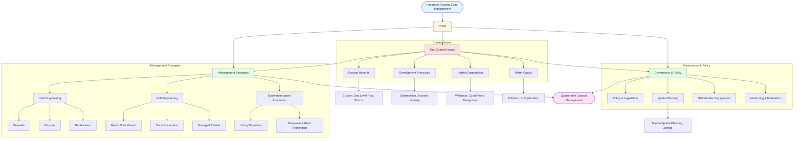

```mermaid
flowchart TD
    Start([Integrated Coastal Zone Management]) --> ICZM[ICZM]
    
    ICZM --> Issues[Key Coastal Issues]
    ICZM --> Strategies[Management Strategies]
    ICZM --> Governance[Governance & Policy]
    
    Issues --> I1[Coastal Hazards]
    Issues --> I2[Development Pressures]
    Issues --> I3[Habitat Degradation]
    Issues --> I4[Water Quality]
    
    I1 --> I1a[Erosion, Sea Level Rise, Storms]
    I2 --> I2a[Urbanization, Tourism, Industry]
    I3 --> I3a[Wetlands, Coral Reefs, Mangroves]
    I4 --> I4a[Pollution, Eutrophication]
    
    Strategies --> Hard[Hard Engineering]
    Strategies --> Soft[Soft Engineering]
    Strategies --> EBA[Ecosystem-based Adaptation]
    
    Hard --> H1[Seawalls]
    Hard --> H2[Groynes]
    Hard --> H3[Breakwaters]
    
    Soft --> S1[Beach Nourishment]
    Soft --> S2[Dune Restoration]
    Soft --> S3[Managed Retreat]
    
    EBA --> EBA1[Living Shorelines]
    EBA --> EBA2[Mangrove & Reef Restoration]
    
    Governance --> G1[Policy & Legislation]
    Governance --> G2[Spatial Planning]
    Governance --> G3[Stakeholder Engagement]
    Governance --> G4[Monitoring & Evaluation]
    
    G2 --> G2a[Marine Spatial Planning, Zoning]
    
    Issues --> Strategies
    Issues --> Governance
    
    Strategies --> End([Sustainable Coastal Management])
    Governance --> End
    
    subgraph Issues_Group["Coastal Issues"]
        Issues
        I1
        I2
        I3
        I4
    end
    
    subgraph Strategies_Group["Management Strategies"]
        Strategies
        Hard
        Soft
        EBA
        H1
        H2
        H3
        S1
        S2
        S3
        EBA1
        EBA2
    end
    
    subgraph Governance_Group["Governance & Policy"]
        Governance
        G1
        G2
        G3
        G4
    end
    
    style Start fill:#e1f5ff
    style End fill:#ffe1f5
    style ICZM fill:#fff4e1
    style Issues fill:#ffe1e1
    style Strategies fill:#e1ffe1
    style Governance fill:#e1ffe1
```
