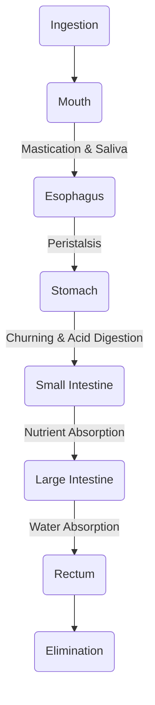

```mermaid
flowchart TD
    A(Ingestion) --> B(Mouth);
    B -- Mastication & Saliva --> C(Esophagus);
    C -- Peristalsis --> D(Stomach);
    D -- Churning & Acid Digestion --> E(Small Intestine);
    E -- Nutrient Absorption --> F(Large Intestine);
    F -- Water Absorption --> G(Rectum);
    G --> H(Elimination);
```
