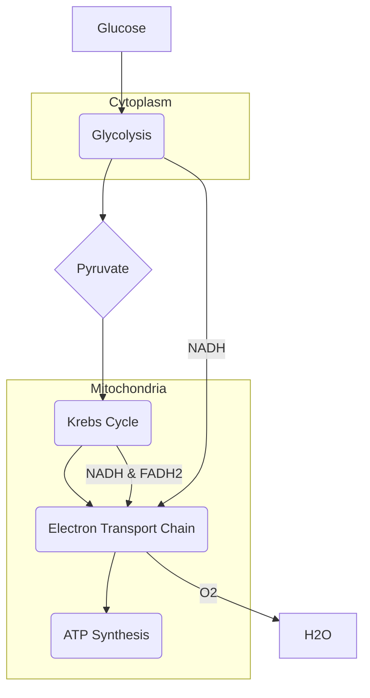

```mermaid
flowchart TD
    A[Glucose] --> B(Glycolysis);
    B --> C{Pyruvate};
    C --> D(Krebs Cycle);
    D --> E(Electron Transport Chain);
    E --> F(ATP Synthesis);

    subgraph Cytoplasm
        B;
    end

    subgraph Mitochondria
        D; E; F;
    end

    B -- NADH --> E;
    D -- NADH & FADH2 --> E;
    E -- O2 --> H2O;
```
