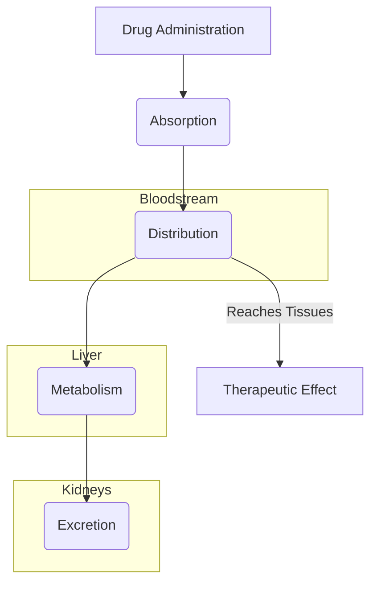

```mermaid
flowchart TD
    A[Drug Administration] --> B(Absorption);
    B --> C(Distribution);
    C --> D(Metabolism);
    D --> E(Excretion);

    subgraph Bloodstream
        C;
    end

    subgraph Liver
        D;
    end

    subgraph Kidneys
        E;
    end

    C -- Reaches Tissues --> F[Therapeutic Effect];
```
