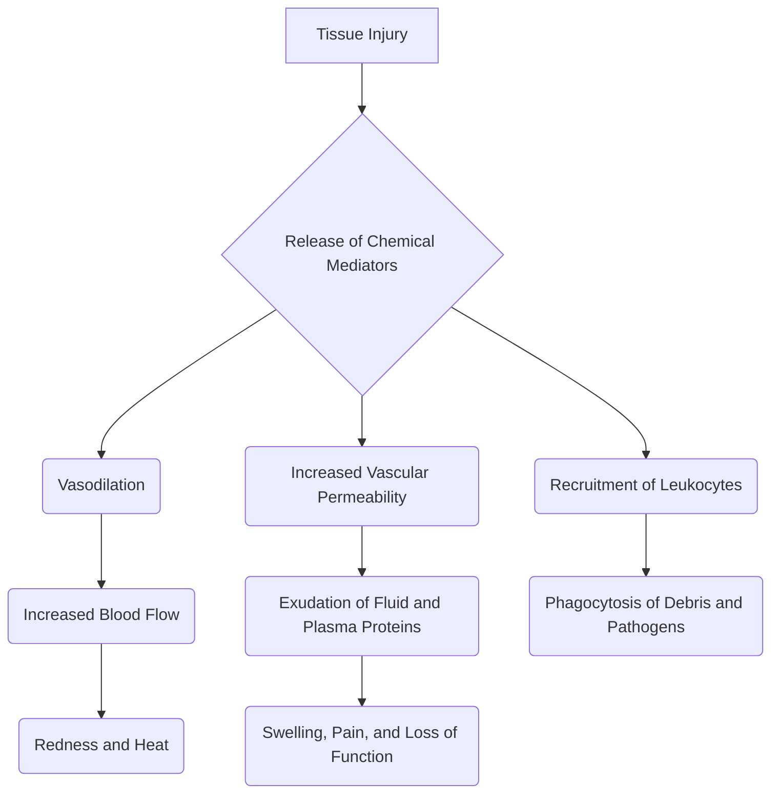

```mermaid
flowchart TD
    A[Tissue Injury] --> B{Release of Chemical Mediators};
    B --> C(Vasodilation);
    B --> D(Increased Vascular Permeability);
    C --> E(Increased Blood Flow);
    D --> F(Exudation of Fluid and Plasma Proteins);
    E --> G(Redness and Heat);
    F --> H(Swelling, Pain, and Loss of Function);
    B --> I(Recruitment of Leukocytes);
    I --> J(Phagocytosis of Debris and Pathogens);
```
