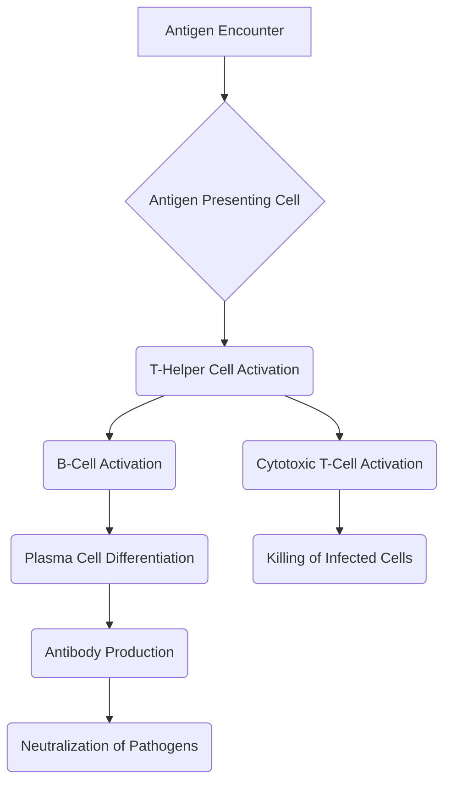

```mermaid
flowchart TD
    A[Antigen Encounter] --> B{Antigen Presenting Cell};
    B --> C(T-Helper Cell Activation);
    C --> D(B-Cell Activation);
    C --> E(Cytotoxic T-Cell Activation);
    D --> F(Plasma Cell Differentiation);
    F --> G(Antibody Production);
    E --> H(Killing of Infected Cells);
    G --> I(Neutralization of Pathogens);
```
