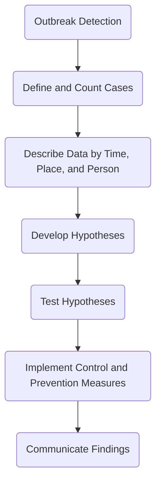

```mermaid
flowchart TD
    A(Outbreak Detection) --> B(Define and Count Cases);
    B --> C(Describe Data by Time, Place, and Person);
    C --> D(Develop Hypotheses);
    D --> E(Test Hypotheses);
    E --> F(Implement Control and Prevention Measures);
    F --> G(Communicate Findings);
```
