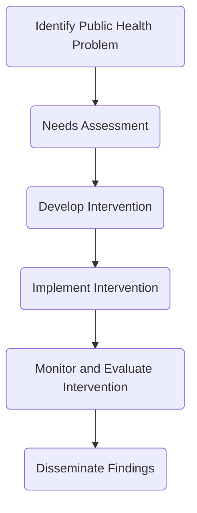

```mermaid
flowchart TD
    A(Identify Public Health Problem) --> B(Needs Assessment);
    B --> C(Develop Intervention);
    C --> D(Implement Intervention);
    D --> E(Monitor and Evaluate Intervention);
    E --> F(Disseminate Findings);
```
