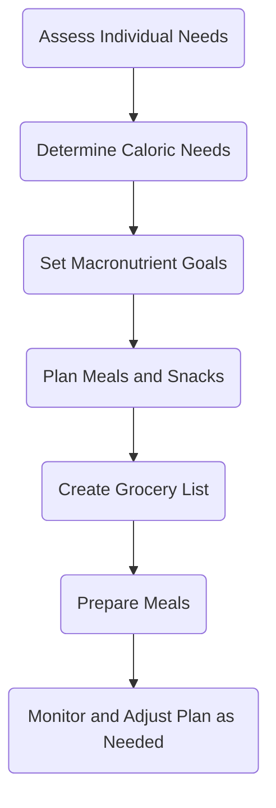

```mermaid
flowchart TD
    A(Assess Individual Needs) --> B(Determine Caloric Needs);
    B --> C(Set Macronutrient Goals);
    C --> D(Plan Meals and Snacks);
    D --> E(Create Grocery List);
    E --> F(Prepare Meals);
    F --> G(Monitor and Adjust Plan as Needed);
```
