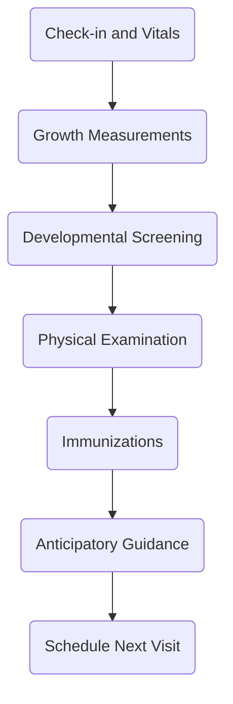

```mermaid
flowchart TD
    A(Check-in and Vitals) --> B(Growth Measurements);
    B --> C(Developmental Screening);
    C --> D(Physical Examination);
    D --> E(Immunizations);
    E --> F(Anticipatory Guidance);
    F --> G(Schedule Next Visit);
```
