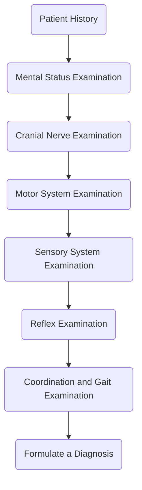

```mermaid
flowchart TD
    A(Patient History) --> B(Mental Status Examination);
    B --> C(Cranial Nerve Examination);
    C --> D(Motor System Examination);
    D --> E(Sensory System Examination);
    E --> F(Reflex Examination);
    F --> G(Coordination and Gait Examination);
    G --> H(Formulate a Diagnosis);
```
