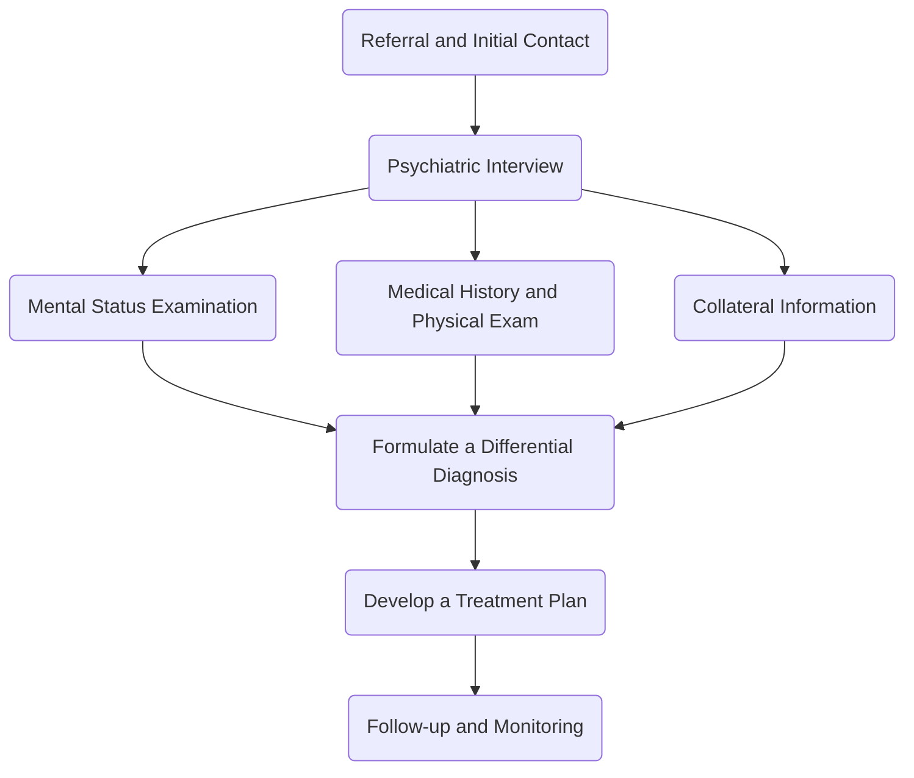

```mermaid
flowchart TD
    A(Referral and Initial Contact) --> B(Psychiatric Interview);
    B --> C(Mental Status Examination);
    B --> D(Medical History and Physical Exam);
    B --> E(Collateral Information);
    C & D & E --> F(Formulate a Differential Diagnosis);
    F --> G(Develop a Treatment Plan);
    G --> H(Follow-up and Monitoring);
```
