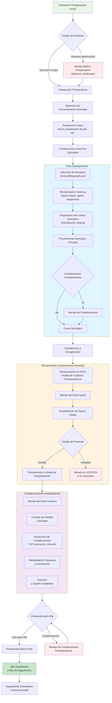

```mermaid
flowchart TD
    A[Evaluación Preoperatoria Inicial] --> B{Estado del Paciente}
    
    B -->|Apto para cirugía| C[Preparación Preoperatoria]
    B -->|Requiere optimización| D[Manejo Médico Preoperatorio<br>Optimizar condiciones]
    
    C --> E[Obtención de Consentimiento Informado]
    E --> F[Preparación Física<br>Ayuno, preparación de piel, etc.]
    F --> G[Transferencia a Área Pre-Quirúrgica]
    
    D --> C
    
    G --> H[Fase Intraoperatoria]
    
    subgraph H[Fase Intraoperatoria]
        H1[Inducción de Anestesia<br>General/Regional/Local]
        H1 --> H2[Monitorización Continua<br>Signos vitales, gases sanguíneos]
        H2 --> H3[Preparación del Campo Quirúrgico<br>Esterilización, draping]
        H3 --> H4[Procedimiento Quirúrgico Principal]
        H4 --> H5{Complicaciones Intraoperatorias}
        H5 -->|No| H6[Cierre Quirúrgico]
        H5 -->|Sí| H7[Manejo de Complicaciones]
        H7 --> H6
    end
    
    H6 --> I[Transferencia a Recuperación]
    
    I --> J[Fase Postoperatoria Inmediata<br>Primeras 24 horas]
    
    subgraph J[Recuperación Postoperatoria Inmediata]
        J1[Monitorización en PACU<br>Unidad de Cuidados Postanestésicos]
        J1 --> J2[Manejo del Dolor Agudo]
        J2 --> J3[Estabilización de Signos Vitales]
        J3 --> J4{Estado del Paciente}
        J4 -->|Estable| K[Transferencia a Unidad de Hospitalización]
        J4 -->|Inestable| L[Manejo en UCI/UCIN<br>si es necesario]
    end
    
    K --> M[Cuidados Postoperatorios Hospitalarios]
    
    subgraph M[Cuidados durante Hospitalización]
        M1[Manejo del Dolor Continuo]
        M2[Cuidado de Heridas<br>y drenajes]
        M3[Prevención de Complicaciones<br>TVP, neumonía, infección]
        M4[Rehabilitación Temprana<br>y movilización]
        M5[Nutrición<br>y soporte metabólico]
    end
    
    M --> N{Evaluación para Alta}
    
    N -->|Listo para alta| O[Preparación para el Alta]
    N -->|Complicaciones| P[Manejo de Complicaciones<br>Postoperatorias]
    
    O --> Q[Alta Hospitalaria<br>y Plan de Seguimiento]
    P --> N
    
    Q --> R[Seguimiento Ambulatorio<br>Control post-alta]
    
    style A fill:#e8f5e8
    style H fill:#e1f5fe
    style J fill:#fff3e0
    style M fill:#f3e5f5
    style Q fill:#c8e6c9
    style D fill:#ffebee
    style L fill:#ffebee
    style P fill:#ffebee
```
