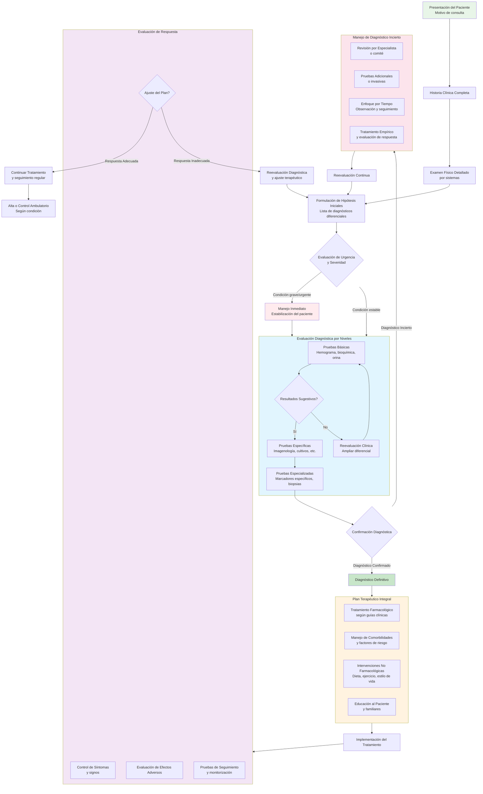

```mermaid
flowchart TD
    A[Presentación del Paciente<br>Motivo de consulta] --> B[Historia Clínica Completa]
    
    B --> C[Examen Físico Detallado<br>por sistemas]
    
    C --> D[Formulación de Hipótesis Iniciales<br>Lista de diagnósticos diferenciales]
    
    D --> E{Evaluación de Urgencia<br>y Severidad}
    
    E -->|Condición grave/urgente| F[Manejo Inmediato<br>Estabilización del paciente]
    E -->|Condición estable| G[Pruebas Diagnósticas Dirigidas]
    
    F --> G
    
    subgraph G[Evaluación Diagnóstica por Niveles]
        G1[Pruebas Básicas<br>Hemograma, bioquímica, orina]
        G1 --> G2{Resultados Sugestivos?}
        G2 -->|Sí| G3[Pruebas Específicas<br>Imagenología, cultivos, etc.]
        G2 -->|No| G4[Reevaluación Clínica<br>Ampliar diferencial]
        G3 --> G5[Pruebas Especializadas<br>Marcadores específicos, biopsias]
        G4 --> G1
    end
    
    G5 --> H{Confirmación Diagnóstica}
    
    H -->|Diagnóstico Confirmado| I[Diagnóstico Definitivo]
    H -->|Diagnóstico Incierto| J[Enfoques Alternativos]
    
    subgraph J[Manejo de Diagnóstico Incierto]
        J1[Revisión por Especialista<br>o comité]
        J2[Pruebas Adicionales<br>o invasivas]
        J3[Enfoque por Tiempo<br>Observación y seguimiento]
        J4[Tratamiento Empírico<br>y evaluación de respuesta]
    end
    
    J --> K[Reevaluación Continua]
    K --> D
    
    I --> L[Desarrollo del Plan de Tratamiento]
    
    subgraph L[Plan Terapéutico Integral]
        L1[Tratamiento Farmacológico<br>según guías clínicas]
        L2[Manejo de Comorbilidades<br>y factores de riesgo]
        L3[Intervenciones No Farmacológicas<br>Dieta, ejercicio, estilo de vida]
        L4[Educación al Paciente<br>y familiares]
    end
    
    L --> M[Implementación del Tratamiento]
    
    M --> N[Seguimiento y Monitorización]
    
    subgraph N[Evaluación de Respuesta]
        N1[Control de Síntomas<br>y signos]
        N2[Evaluación de Efectos Adversos]
        N3[Pruebas de Seguimiento<br>y monitorización]
        N4{Ajuste del Plan?}
    end
    
    N4 -->|Respuesta Adecuada| O[Continuar Tratamiento<br>y seguimiento regular]
    N4 -->|Respuesta Inadecuada| P[Reevaluación Diagnóstica<br>y ajuste terapéutico]
    
    O --> Q[Alta o Control Ambulatorio<br>Según condición]
    P --> D
    
    style A fill:#e8f5e8
    style I fill:#c8e6c9
    style F fill:#ffebee
    style G fill:#e1f5fe
    style L fill:#fff3e0
    style N fill:#f3e5f5
    style J fill:#fce4ec
```
