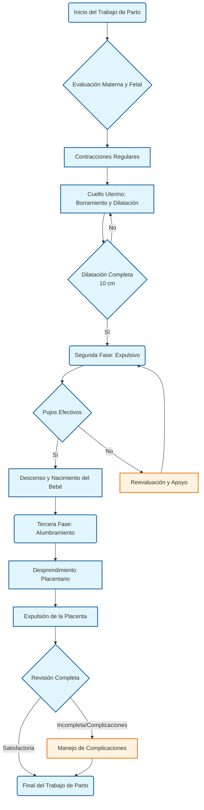

```mermaid
flowchart TD
    A(Inicio del Trabajo de Parto) --> B{Evaluación Materna y Fetal};
    B --> C[Contracciones Regulares];
    C --> D[Cuello Uterino: Borramiento y Dilatación];
    D --> E{Dilatación Completa<br>10 cm};
    E -- Sí --> F(Segunda Fase: Expulsivo);
    E -- No --> D;
    
    F --> G{Pujos Efectivos};
    G -- Sí --> H[Descenso y Nacimiento del Bebé];
    G -- No --> I[Reevaluación y Apoyo];
    I --> F;
    
    H --> J(Tercera Fase: Alumbramiento);
    J --> K[Desprendimiento Placentario];
    K --> L[Expulsión de la Placenta];
    L --> M{Revisión Completa};
    M -- Satisfactoria --> N(Final del Trabajo de Parto);
    M -- Incompleta/Complicaciones --> O[Manejo de Complicaciones];
    O --> N;
    
    %% Estilos para mejor visualización
    classDef primary fill:#e1f5fe,stroke:#01579b,stroke-width:2px;
    classDef secondary fill:#f3e5f5,stroke:#4a148c,stroke-width:2px;
    classDef success fill:#e8f5e8,stroke:#2e7d32,stroke-width:2px;
    classDef warning fill:#fff3e0,stroke:#ef6c00,stroke-width:2px;
    
    class A,B,C,D,E,F,G,H,J,K,L,M,N primary;
    class I,O warning;
```
