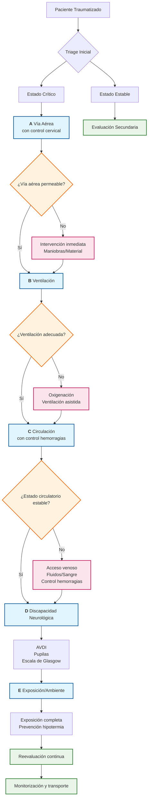

```mermaid
flowchart TD
    Start[Paciente Traumatizado] --> Triage{Triage Inicial}
    
    Triage --> Critico[Estado Crítico]
    Triage --> Estable[Estado Estable]
    
    Critico --> A[<b>A</b> Vía Aérea<br/>con control cervical]
    
    A --> A1{¿Vía aérea permeable?}
    A1 -->|No| A2[Intervención inmediata<br/>Maniobras/Material]
    A1 -->|Sí| B
    
    A2 --> B[<b>B</b> Ventilación]
    
    B --> B1{¿Ventilación adecuada?}
    B1 -->|No| B2[Oxigenación<br/>Ventilación asistida]
    B1 -->|Sí| C
    
    B2 --> C[<b>C</b> Circulación<br/>con control hemorragias]
    
    C --> C1{¿Estado circulatorio estable?}
    C1 -->|No| C2[Acceso venoso<br/>Fluidos/Sangre<br/>Control hemorragias]
    C1 -->|Sí| D
    
    C2 --> D[<b>D</b> Discapacidad Neurológica]
    
    D --> D1[AVDI<br/>Pupilas<br/>Escala de Glasgow]
    D1 --> E[<b>E</b> Exposición/Ambiente]
    
    E --> E1[Exposición completa<br/>Prevención hipotermia]
    E1 --> Reval[Reevaluación continua]
    Reval --> Monitor[Monitorización y transporte]
    
    Estable --> EvaluacionSec[Evaluación Secundaria]
    
    classDef primary fill:#e1f5fe,stroke:#01579b,stroke-width:2px
    classDef decision fill:#fff3e0,stroke:#ef6c00,stroke-width:2px
    classDef intervention fill:#fce4ec,stroke:#c2185b,stroke-width:2px
    classDef next fill:#e8f5e8,stroke:#2e7d32,stroke-width:2px
    
    class A,B,C,D,E primary
    class A1,B1,C1 decision
    class A2,B2,C2 intervention
    class Reval,Monitor,EvaluacionSec next
```
