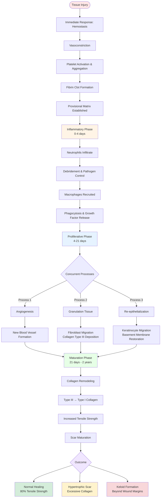

```mermaid
flowchart TD
    Start([Tissue Injury]) --> A[Immediate Response: Hemostasis]
    
    A --> A1[Vasoconstriction]
    A1 --> A2[Platelet Activation & Aggregation]
    A2 --> A3[Fibrin Clot Formation]
    A3 --> A4[Provisional Matrix Established]
    
    A4 --> B[Inflammatory Phase<br/>0-4 days]
    
    B --> B1[Neutrophils Infiltrate]
    B1 --> B2[Debridement & Pathogen Control]
    B2 --> B3[Macrophages Recruited]
    B3 --> B4[Phagocytosis & Growth Factor Release]
    
    B4 --> C[Proliferative Phase<br/>4-21 days]
    
    C --> C1{Concurrent Processes}
    
    C1 -->|Process 1| C2[Angiogenesis]
    C2 --> C3[New Blood Vessel Formation]
    
    C1 -->|Process 2| C4[Granulation Tissue]
    C4 --> C5[Fibroblast Migration<br/>Collagen Type III Deposition]
    
    C1 -->|Process 3| C6[Re-epithelialization]
    C6 --> C7[Keratinocyte Migration<br/>Basement Membrane Restoration]
    
    C3 --> D[Maturation Phase<br/>21 days - 2 years]
    C5 --> D
    C7 --> D
    
    D --> D1[Collagen Remodeling]
    D1 --> D2[Type III → Type I Collagen]
    D2 --> D3[Increased Tensile Strength]
    D3 --> D4[Scar Maturation]
    
    D4 --> End{Outcome}
    
    End --> E1[Normal Healing<br/>80% Tensile Strength]
    End --> E2[Hypertrophic Scar<br/>Excessive Collagen]
    End --> E3[Keloid Formation<br/>Beyond Wound Margins]
    
    style Start fill:#ffe6e6
    style B fill:#fff4e6
    style C fill:#e6f3ff
    style D fill:#e6ffe6
    style End fill:#f0e6ff
    style E1 fill:#d4edda
    style E2 fill:#fff3cd
    style E3 fill:#f8d7da
```
