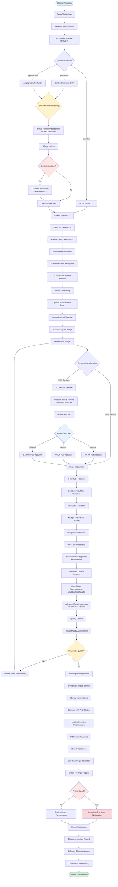

```mermaid
flowchart TD
    Start([Clinical Indication]) --> A[Order Verification]
    
    A --> A1[Review Clinical History]
    A1 --> A2[Appropriate Imaging Modality?]
    A2 --> A3{Protocol Selection}
    
    A3 -->|Standard| A4[Non-Contrast CT]
    A3 -->|Enhanced| A5[Contrast-Enhanced CT]
    A3 -->|Specialized| A6[Angiography/Perfusion]
    
    A4 --> B[Patient Preparation]
    A5 --> B1{Contrast Safety Screening}
    A6 --> B1
    
    B1 --> B2[Renal Function Assessment<br/>eGFR/Creatinine]
    B2 --> B3[Allergy History]
    B3 --> B4{Contraindications?}
    
    B4 -->|Yes| B5[Consider Alternative<br/>or Premedication]
    B4 -->|No| B6[Contrast Approved]
    B5 --> B6
    
    B6 --> B
    B --> C[Pre-Scan Preparation]
    
    C --> C1[Patient Identity Verification]
    C1 --> C2[Remove Metal Objects]
    C2 --> C3[NPO Verification if Required]
    C3 --> C4[IV Access if Contrast Needed]
    
    C4 --> D[Patient Positioning]
    
    D --> D1[Optimal Positioning on Table]
    D1 --> D2[Immobilization if Needed]
    D2 --> D3[Scout/Topogram Image]
    D3 --> D4[Define Scan Range]
    
    D4 --> E{Contrast Administration}
    
    E -->|Non-Contrast| F[Image Acquisition]
    E -->|With Contrast| E1[IV Contrast Injection]
    
    E1 --> E2[Injection Rate & Volume<br/>Based on Protocol]
    E2 --> E3[Timing Selection]
    E3 --> E4{Phase Selection}
    
    E4 -->|Arterial| E5[20-30s Post-Injection]
    E4 -->|Venous| E6[60-70s Post-Injection]
    E4 -->|Delayed| E7[3-10 min Post-Injection]
    
    E5 --> F
    E6 --> F
    E7 --> F
    
    F --> F1[X-ray Tube Rotation]
    F1 --> F2[Detector Array Data Collection]
    F2 --> F3[Raw Data Acquisition]
    F3 --> F4[Multiple Projections Captured]
    
    F4 --> G[Image Reconstruction]
    
    G --> G1[Raw Data Processing]
    G1 --> G2[Reconstruction Algorithm<br/>FBP/Iterative]
    G2 --> G3[3D Volume Dataset Creation]
    G3 --> G4[Multi-Planar Reconstructions<br/>Axial/Coronal/Sagittal]
    G4 --> G5[Advanced Post-Processing<br/>MIP/VR/3D if Needed]
    
    G5 --> H[Quality Control]
    
    H --> H1[Image Quality Assessment]
    H1 --> H2{Diagnostic Quality?}
    
    H2 -->|No| H3[Repeat Scan if Necessary]
    H3 --> D4
    H2 -->|Yes| I[Radiologist Interpretation]
    
    I --> I1[Systematic Image Review]
    I1 --> I2[Identify Abnormalities]
    I2 --> I3[Compare with Prior Studies]
    I3 --> I4[Measurements & Quantification]
    I4 --> I5[Differential Diagnosis]
    
    I5 --> J[Report Generation]
    
    J --> J1[Structured Report Creation]
    J1 --> J2[Critical Findings Flagged]
    J2 --> J3{Critical Result?}
    
    J3 -->|Yes| J4[Immediate Physician Notification]
    J3 -->|No| J5[Routine Report Transmission]
    
    J4 --> K[Report Distribution]
    J5 --> K
    
    K --> K1[Electronic Medical Record]
    K1 --> K2[Referring Physician Access]
    K2 --> K3[Clinical Decision Making]
    
    K3 --> End([Patient Management])
    
    style Start fill:#e1f5ff
    style B1 fill:#fff3cd
    style B4 fill:#ffe6e6
    style E4 fill:#e6f3ff
    style H2 fill:#fff3cd
    style J3 fill:#ffe6e6
    style J4 fill:#f8d7da
    style End fill:#d4edda
```
