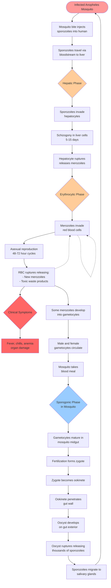

```mermaid
flowchart TD
    Start([Infected Anopheles Mosquito]) --> A[Mosquito bite injects<br/>sporozoites into human]
    
    A --> B[Sporozoites travel via<br/>bloodstream to liver]
    B --> C{Hepatic Phase}
    C --> D[Sporozoites invade<br/>hepatocytes]
    D --> E[Schizogony in liver cells<br/>5-15 days]
    E --> F[Hepatocyte ruptures<br/>releases merozoites]
    
    F --> G{Erythrocytic Phase}
    G --> H[Merozoites invade<br/>red blood cells]
    H --> I[Asexual reproduction<br/>48-72 hour cycles]
    I --> J[RBC ruptures releasing:<br/>- New merozoites<br/>- Toxic waste products]
    
    J --> K{Clinical Symptoms}
    K --> L[Fever, chills, anemia<br/>organ damage]
    
    J --> M[Some merozoites develop<br/>into gametocytes]
    M --> N[Male and female<br/>gametocytes circulate]
    
    N --> O[Mosquito takes<br/>blood meal]
    O --> P{Sporogonic Phase<br/>in Mosquito}
    
    P --> Q[Gametocytes mature in<br/>mosquito midgut]
    Q --> R[Fertilization forms zygote]
    R --> S[Zygote becomes ookinete]
    S --> T[Ookinete penetrates<br/>gut wall]
    T --> U[Oocyst develops<br/>on gut exterior]
    U --> V[Oocyst ruptures releasing<br/>thousands of sporozoites]
    V --> W[Sporozoites migrate to<br/>salivary glands]
    W --> Start
    
    H -.-> H
    J -.-> H
    
    style Start fill:#ff9999
    style C fill:#ffcc99
    style G fill:#ffcc99
    style P fill:#99ccff
    style K fill:#ff6666
    style L fill:#ff6666
```
