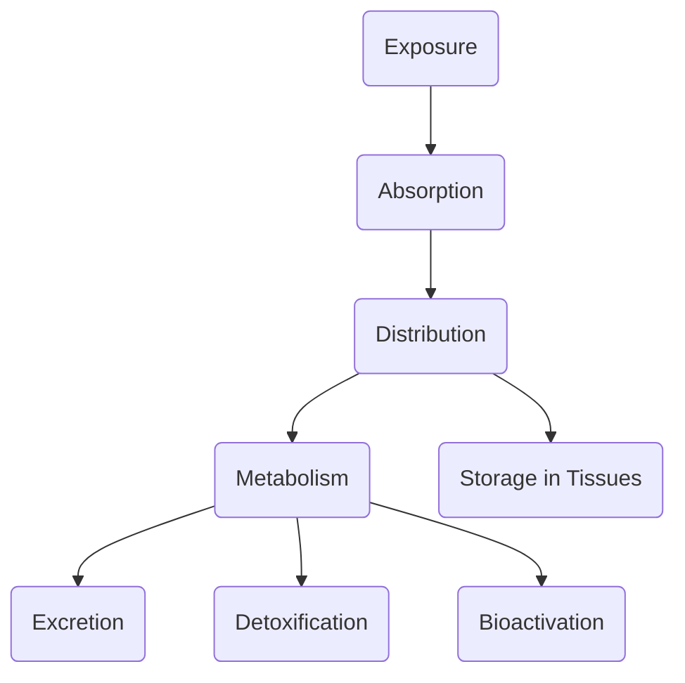

```mermaid
flowchart TD
    A(Exposure) --> B(Absorption);
    B --> C(Distribution);
    C --> D(Metabolism);
    D --> E(Excretion);
    C --> F(Storage in Tissues);
    D --> G(Detoxification);
    D --> H(Bioactivation);
```
