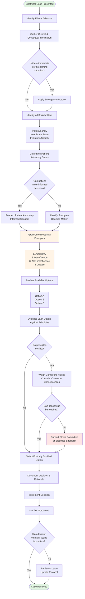

```mermaid
flowchart TD
    Start([Bioethical Case Presented]) --> A[Identify Ethical Dilemma]
    A --> B[Gather Clinical & Contextual Information]
    
    B --> C{Is there immediate<br/>life-threatening<br/>situation?}
    C -->|Yes| D[Apply Emergency Protocol]
    C -->|No| E[Identify All Stakeholders]
    
    D --> E
    E --> F[Patient/Family<br/>Healthcare Team<br/>Institution/Society]
    
    F --> G[Determine Patient Autonomy Status]
    G --> H{Can patient<br/>make informed<br/>decisions?}
    
    H -->|Yes| I[Respect Patient Autonomy<br/>Informed Consent]
    H -->|No| J[Identify Surrogate<br/>Decision Maker]
    
    I --> K[Apply Core Bioethical Principles]
    J --> K
    
    K --> L[1. Autonomy<br/>2. Beneficence<br/>3. Non-maleficence<br/>4. Justice]
    
    L --> M[Analyze Available Options]
    M --> N[Option A<br/>Option B<br/>Option C]
    
    N --> O[Evaluate Each Option Against Principles]
    O --> P{Do principles<br/>conflict?}
    
    P -->|Yes| Q[Weigh Competing Values<br/>Consider Context & Consequences]
    P -->|No| R[Select Ethically Justified Option]
    
    Q --> S{Can consensus<br/>be reached?}
    S -->|No| T[Consult Ethics Committee<br/>or Bioethics Specialist]
    S -->|Yes| R
    
    T --> R
    R --> U[Document Decision & Rationale]
    U --> V[Implement Decision]
    V --> W[Monitor Outcomes]
    
    W --> X{Was decision<br/>ethically sound<br/>in practice?}
    X -->|No| Y[Review & Learn<br/>Update Protocol]
    X -->|Yes| Z([Case Resolved])
    
    Y --> Z
    
    style Start fill:#e1f5e1
    style Z fill:#e1f5e1
    style K fill:#fff4e6
    style L fill:#fff4e6
    style T fill:#ffe6e6
```
