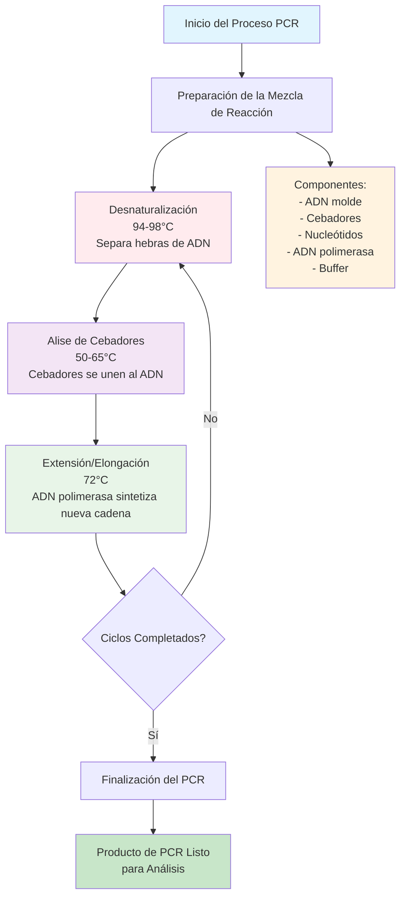

```mermaid
flowchart TD
    A[Inicio del Proceso PCR] --> B[Preparación de la Mezcla de Reacción]
    
    B --> C[Desnaturalización<br>94-98°C<br>Separa hebras de ADN]
    C --> D[Alise de Cebadores<br>50-65°C<br>Cebadores se unen al ADN]
    D --> E[Extensión/Elongación<br>72°C<br>ADN polimerasa sintetiza nueva cadena]
    
    E --> F{Ciclos Completados?}
    F -->|No| C
    F -->|Sí| G[Finalización del PCR]
    
    G --> H[Producto de PCR Listo<br>para Análisis]
    
    %% Componentes de la mezcla
    B --> I[Componentes:<br>- ADN molde<br>- Cebadores<br>- Nucleótidos<br>- ADN polimerasa<br>- Buffer]
    
    style A fill:#e1f5fe
    style H fill:#c8e6c9
    style I fill:#fff3e0
    style C fill:#ffebee
    style D fill:#f3e5f5
    style E fill:#e8f5e8
```
