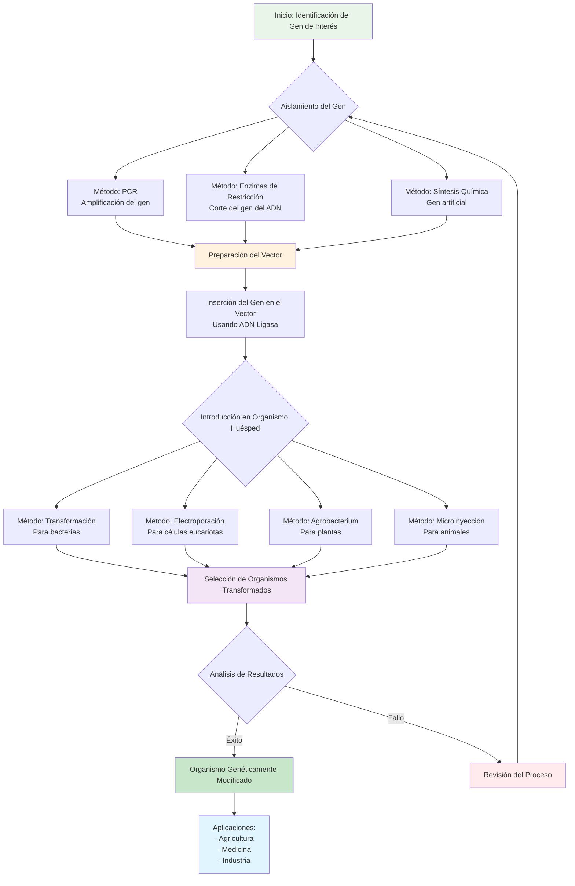

```mermaid
flowchart TD
    A[Inicio: Identificación del Gen de Interés] --> B{Aislamiento del Gen}
    
    B --> C[Método: PCR<br>Amplificación del gen]
    B --> D[Método: Enzimas de Restricción<br>Corte del gen del ADN]
    B --> E[Método: Síntesis Química<br>Gen artificial]
    
    C --> F[Preparación del Vector]
    D --> F
    E --> F
    
    F --> G[Inserción del Gen en el Vector<br>Usando ADN Ligasa]
    
    G --> H{Introducción en Organismo Huésped}
    
    H --> I[Método: Transformación<br>Para bacterias]
    H --> J[Método: Electroporación<br>Para células eucariotas]
    H --> K[Método: Agrobacterium<br>Para plantas]
    H --> L[Método: Microinyección<br>Para animales]
    
    I --> M[Selección de Organismos Transformados]
    J --> M
    K --> M
    L --> M
    
    M --> N{Análisis de Resultados}
    N -->|Éxito| O[Organismo Genéticamente Modificado]
    N -->|Fallo| P[Revisión del Proceso]
    
    O --> Q[Aplicaciones:<br>- Agricultura<br>- Medicina<br>- Industria]
    P --> B
    
    style A fill:#e8f5e8
    style O fill:#c8e6c9
    style Q fill:#e1f5fe
    style F fill:#fff3e0
    style M fill:#f3e5f5
    style P fill:#ffebee
```
