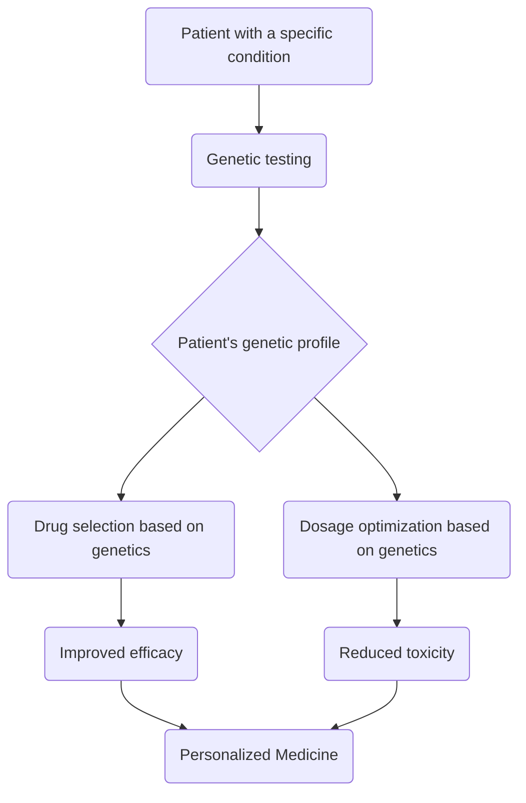

```mermaid
flowchart TD
    A(Patient with a specific condition) --> B(Genetic testing);
    B --> C{Patient's genetic profile};
    C --> D(Drug selection based on genetics);
    C --> E(Dosage optimization based on genetics);
    D --> F(Improved efficacy);
    E --> G(Reduced toxicity);
    F --> H(Personalized Medicine);
    G --> H;
```
