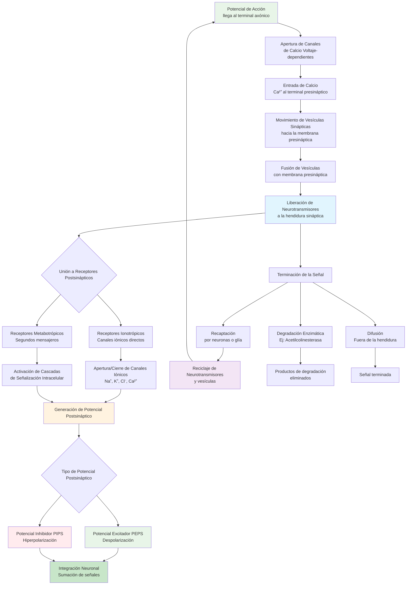

```mermaid
flowchart TD
    A[Potencial de Acción<br>llega al terminal axónico] --> B[Apertura de Canales<br>de Calcio Voltaje-dependientes]
    
    B --> C[Entrada de Calcio<br>Ca²⁺ al terminal presináptico]
    
    C --> D[Movimiento de Vesículas Sinápticas<br>hacia la membrana presináptica]
    
    D --> E[Fusión de Vesículas<br>con membrana presináptica]
    
    E --> F[Liberación de Neurotransmisores<br>a la hendidura sináptica]
    
    F --> G{Unión a Receptores Postsinápticos}
    
    G --> H[Receptores Ionotrópicos<br>Canales iónicos directos]
    G --> I[Receptores Metabotrópicos<br>Segundos mensajeros]
    
    H --> J[Apertura/Cierre de Canales Iónicos<br>Na⁺, K⁺, Cl⁻, Ca²⁺]
    I --> K[Activación de Cascadas<br>de Señalización Intracelular]
    
    J --> L[Generación de Potencial Postsináptico]
    K --> L
    
    L --> M{Tipo de Potencial Postsináptico}
    M --> N[Potencial Excitador PEPS<br>Despolarización]
    M --> O[Potencial Inhibidor PIPS<br>Hiperpolarización]
    
    N --> P[Integración Neuronal<br>Sumación de señales]
    O --> P
    
    F --> Q[Terminación de la Señal]
    
    Q --> R[Recaptación<br>por neuronas o glía]
    Q --> S[Degradación Enzimática<br>Ej: Acetilcolinesterasa]
    Q --> T[Difusión<br>Fuera de la hendidura]
    
    R --> U[Reciclaje de Neurotransmisores<br>y vesículas]
    S --> V[Productos de degradación<br>eliminados]
    T --> W[Señal terminada]
    
    U --> A
    
    style A fill:#e8f5e8
    style F fill:#e1f5fe
    style L fill:#fff3e0
    style P fill:#c8e6c9
    style N fill:#e8f5e8
    style O fill:#ffebee
    style U fill:#f3e5f5
```
