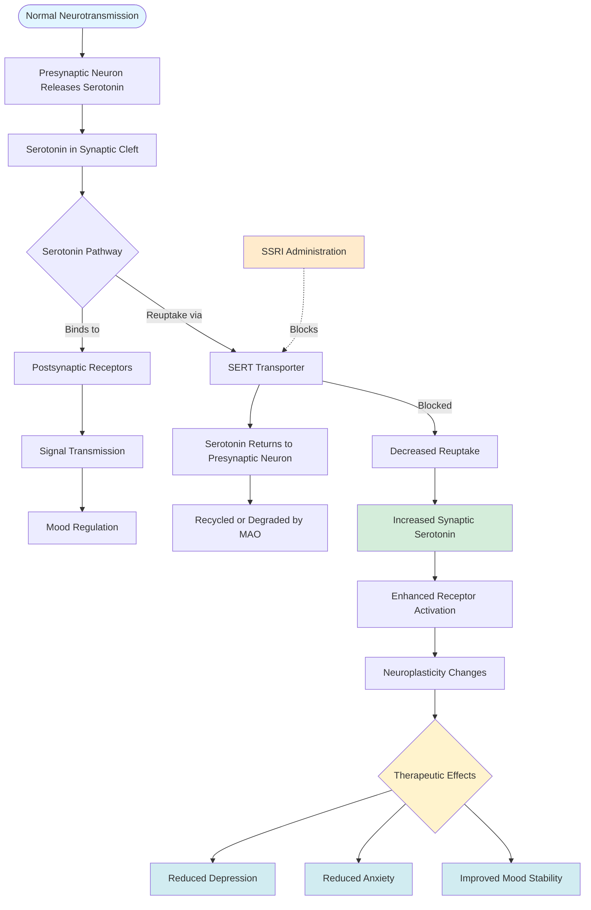

```mermaid
flowchart TD
    Start([Normal Neurotransmission]) --> A[Presynaptic Neuron Releases Serotonin]
    
    A --> B[Serotonin in Synaptic Cleft]
    
    B --> C{Serotonin Pathway}
    
    C -->|Binds to| D[Postsynaptic Receptors]
    C -->|Reuptake via| E[SERT Transporter]
    
    D --> F[Signal Transmission]
    F --> G[Mood Regulation]
    
    E --> H[Serotonin Returns to Presynaptic Neuron]
    H --> I[Recycled or Degraded by MAO]
    
    SSRI[SSRI Administration] -.->|Blocks| E
    
    E -->|Blocked| J[Decreased Reuptake]
    J --> K[Increased Synaptic Serotonin]
    
    K --> L[Enhanced Receptor Activation]
    L --> M[Neuroplasticity Changes]
    
    M --> N{Therapeutic Effects}
    
    N --> O[Reduced Depression]
    N --> P[Reduced Anxiety]
    N --> Q[Improved Mood Stability]
    
    style Start fill:#e1f5ff
    style SSRI fill:#ffebcc
    style K fill:#d4edda
    style N fill:#fff3cd
    style O fill:#d1ecf1
    style P fill:#d1ecf1
    style Q fill:#d1ecf1
```
