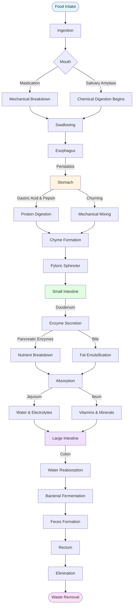

```mermaid
flowchart TD
    Start([Food Intake]) --> A[Ingestion]
    A --> B{Mouth}
    B -->|Mastication| C[Mechanical Breakdown]
    B -->|Salivary Amylase| D[Chemical Digestion Begins]
    C --> E[Swallowing]
    D --> E
    E --> F[Esophagus]
    F -->|Peristalsis| G[Stomach]
    G -->|Gastric Acid & Pepsin| H[Protein Digestion]
    G -->|Churning| I[Mechanical Mixing]
    H --> J[Chyme Formation]
    I --> J
    J --> K[Pyloric Sphincter]
    K --> L[Small Intestine]
    L -->|Duodenum| M[Enzyme Secretion]
    M -->|Pancreatic Enzymes| N[Nutrient Breakdown]
    M -->|Bile| O[Fat Emulsification]
    N --> P[Absorption]
    O --> P
    P -->|Jejunum| Q[Water & Electrolytes]
    P -->|Ileum| R[Vitamins & Minerals]
    Q --> S[Large Intestine]
    R --> S
    S -->|Colon| T[Water Reabsorption]
    T --> U[Bacterial Fermentation]
    U --> V[Feces Formation]
    V --> W[Rectum]
    W --> X[Elimination]
    X --> End([Waste Removal])
    
    style Start fill:#e1f5ff
    style End fill:#ffe1f5
    style G fill:#fff4e1
    style L fill:#e1ffe1
    style S fill:#f0e1ff
```
