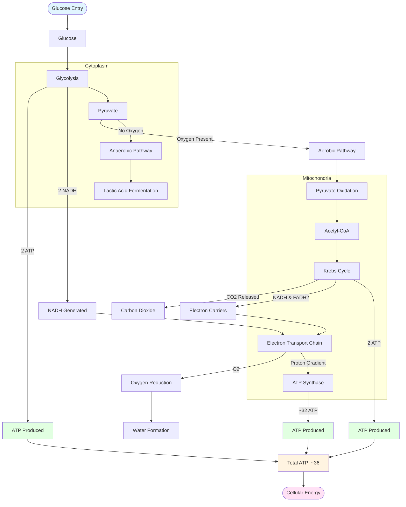

```mermaid
flowchart TD
    Start([Glucose Entry]) --> A[Glucose]
    A --> B[Glycolysis]
    B -->|2 ATP| Energy1[ATP Produced]
    B -->|2 NADH| C[NADH Generated]
    B --> D[Pyruvate]
    D -->|Oxygen Present| E[Aerobic Pathway]
    D -->|No Oxygen| F[Anaerobic Pathway]
    F --> G[Lactic Acid Fermentation]
    E --> H[Pyruvate Oxidation]
    H --> I[Acetyl-CoA]
    I --> J[Krebs Cycle]
    J -->|CO2 Released| K[Carbon Dioxide]
    J -->|NADH & FADH2| L[Electron Carriers]
    J -->|2 ATP| Energy2[ATP Produced]
    C --> M[Electron Transport Chain]
    L --> M
    M -->|O2| N[Oxygen Reduction]
    N --> O[Water Formation]
    M -->|Proton Gradient| P[ATP Synthase]
    P -->|~32 ATP| Energy3[ATP Produced]
    Energy1 --> Total[Total ATP: ~36]
    Energy2 --> Total
    Energy3 --> Total
    Total --> End([Cellular Energy])
    
    subgraph Cytoplasm["Cytoplasm"]
        B
        D
        F
        G
    end
    
    subgraph Mitochondria["Mitochondria"]
        H
        I
        J
        M
        P
    end
    
    style Start fill:#e1f5ff
    style End fill:#ffe1f5
    style Energy1 fill:#e1ffe1
    style Energy2 fill:#e1ffe1
    style Energy3 fill:#e1ffe1
    style Total fill:#fff4e1
```
