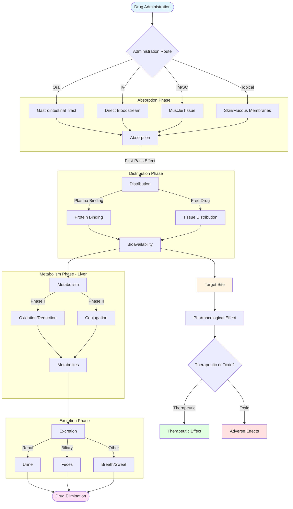

```mermaid
flowchart TD
    Start([Drug Administration]) --> Route{Administration Route}
    Route -->|Oral| A1[Gastrointestinal Tract]
    Route -->|IV| A2[Direct Bloodstream]
    Route -->|IM/SC| A3[Muscle/Tissue]
    Route -->|Topical| A4[Skin/Mucous Membranes]
    A1 --> B[Absorption]
    A2 --> B
    A3 --> B
    A4 --> B
    B -->|First-Pass Effect| C[Distribution]
    C -->|Plasma Binding| D[Protein Binding]
    C -->|Free Drug| E[Tissue Distribution]
    D --> F[Bioavailability]
    E --> F
    F --> G[Target Site]
    G --> H[Pharmacological Effect]
    H --> I{Therapeutic or Toxic?}
    I -->|Therapeutic| J[Therapeutic Effect]
    I -->|Toxic| K[Adverse Effects]
    F --> L[Metabolism]
    L -->|Phase I| M[Oxidation/Reduction]
    L -->|Phase II| N[Conjugation]
    M --> O[Metabolites]
    N --> O
    O --> P[Excretion]
    P -->|Renal| Q[Urine]
    P -->|Biliary| R[Feces]
    P -->|Other| S[Breath/Sweat]
    Q --> End([Drug Elimination])
    R --> End
    S --> End
    
    subgraph Absorption_Phase["Absorption Phase"]
        A1
        A2
        A3
        A4
        B
    end
    
    subgraph Distribution_Phase["Distribution Phase"]
        C
        D
        E
        F
    end
    
    subgraph Metabolism_Phase["Metabolism Phase - Liver"]
        L
        M
        N
        O
    end
    
    subgraph Excretion_Phase["Excretion Phase"]
        P
        Q
        R
        S
    end
    
    style Start fill:#e1f5ff
    style End fill:#ffe1f5
    style J fill:#e1ffe1
    style K fill:#ffe1e1
    style G fill:#fff4e1
```
