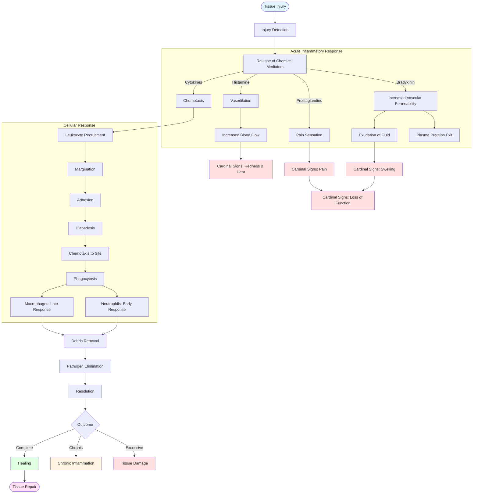

```mermaid
flowchart TD
    Start([Tissue Injury]) --> A[Injury Detection]
    A --> B[Release of Chemical Mediators]
    B -->|Histamine| C[Vasodilation]
    B -->|Bradykinin| D[Increased Vascular Permeability]
    B -->|Prostaglandins| E[Pain Sensation]
    B -->|Cytokines| F[Chemotaxis]
    C --> G[Increased Blood Flow]
    D --> H[Exudation of Fluid]
    D --> I[Plasma Proteins Exit]
    G --> J[Cardinal Signs: Redness & Heat]
    H --> K[Cardinal Signs: Swelling]
    E --> L[Cardinal Signs: Pain]
    K --> M[Cardinal Signs: Loss of Function]
    L --> M
    F --> N[Leukocyte Recruitment]
    N --> O[Margination]
    O --> P[Adhesion]
    P --> Q[Diapedesis]
    Q --> R[Chemotaxis to Site]
    R --> S[Phagocytosis]
    S --> T[Neutrophils: Early Response]
    S --> U[Macrophages: Late Response]
    T --> V[Debris Removal]
    U --> V
    V --> W[Pathogen Elimination]
    W --> X[Resolution]
    X --> Y{Outcome}
    Y -->|Complete| Z[Healing]
    Y -->|Chronic| AA[Chronic Inflammation]
    Y -->|Excessive| BB[Tissue Damage]
    Z --> End([Tissue Repair])
    
    subgraph Acute_Phase["Acute Inflammatory Response"]
        B
        C
        D
        E
        F
        G
        H
        I
    end
    
    subgraph Cellular_Response["Cellular Response"]
        N
        O
        P
        Q
        R
        S
        T
        U
    end
    
    style Start fill:#e1f5ff
    style End fill:#ffe1f5
    style J fill:#ffe1e1
    style K fill:#ffe1e1
    style L fill:#ffe1e1
    style M fill:#ffe1e1
    style Z fill:#e1ffe1
    style AA fill:#fff4e1
    style BB fill:#ffe1e1
```
