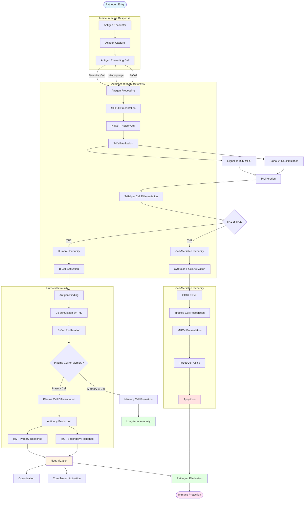

```mermaid
flowchart TD
    Start([Pathogen Entry]) --> A[Antigen Encounter]
    A --> B[Antigen Capture]
    B --> C[Antigen Presenting Cell]
    C -->|Dendritic Cell| D[Antigen Processing]
    C -->|Macrophage| D
    C -->|B-Cell| D
    D --> E[MHC-II Presentation]
    E --> F[Naive T-Helper Cell]
    F --> G[T-Cell Activation]
    G --> H[Signal 1: TCR-MHC]
    G --> I[Signal 2: Co-stimulation]
    H --> J[Proliferation]
    I --> J
    J --> K[T-Helper Cell Differentiation]
    K --> L{TH1 or TH2?}
    L -->|TH1| M[Cell-Mediated Immunity]
    L -->|TH2| N[Humoral Immunity]
    M --> O[Cytotoxic T-Cell Activation]
    O --> P[CD8+ T-Cell]
    P --> Q[Infected Cell Recognition]
    Q --> R[MHC-I Presentation]
    R --> S[Target Cell Killing]
    S --> T[Apoptosis]
    N --> U[B-Cell Activation]
    U --> V[Antigen Binding]
    V --> W[Co-stimulation by TH2]
    W --> X[B-Cell Proliferation]
    X --> Y{Plasma Cell or Memory?}
    Y -->|Plasma Cell| Z[Plasma Cell Differentiation]
    Y -->|Memory B-Cell| AA[Memory Cell Formation]
    Z --> BB[Antibody Production]
    BB --> CC[IgM - Primary Response]
    BB --> DD[IgG - Secondary Response]
    CC --> EE[Neutralization]
    DD --> EE
    EE --> FF[Opsonization]
    EE --> GG[Complement Activation]
    EE --> HH[Pathogen Elimination]
    T --> HH
    AA --> II[Long-term Immunity]
    HH --> End([Immune Protection])
    
    subgraph Innate_Response["Innate Immune Response"]
        A
        B
        C
    end
    
    subgraph Adaptive_Response["Adaptive Immune Response"]
        D
        E
        F
        G
        K
        M
        N
        O
        U
    end
    
    subgraph Cell_Mediated["Cell-Mediated Immunity"]
        O
        P
        Q
        R
        S
        T
    end
    
    subgraph Humoral_Immunity["Humoral Immunity"]
        U
        V
        W
        X
        Y
        Z
        BB
        CC
        DD
    end
    
    style Start fill:#e1f5ff
    style End fill:#ffe1f5
    style HH fill:#e1ffe1
    style T fill:#ffe1e1
    style EE fill:#fff4e1
    style II fill:#e1ffe1
```
