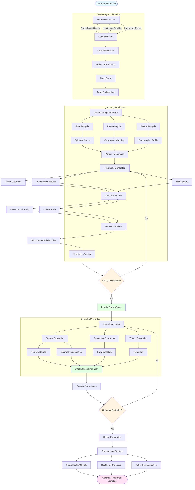

```mermaid
flowchart TD
    Start([Outbreak Suspected]) --> A[Outbreak Detection]
    A -->|Surveillance System| B[Case Definition]
    A -->|Healthcare Provider| B
    A -->|Laboratory Report| B
    B --> C[Case Identification]
    C --> D[Active Case Finding]
    D --> E[Case Count]
    E --> F[Case Confirmation]
    F --> G[Descriptive Epidemiology]
    G --> H[Time Analysis]
    G --> I[Place Analysis]
    G --> J[Person Analysis]
    H --> K[Epidemic Curve]
    I --> L[Geographic Mapping]
    J --> M[Demographic Profile]
    K --> N[Pattern Recognition]
    L --> N
    M --> N
    N --> O[Hypothesis Generation]
    O --> P[Possible Sources]
    O --> Q[Transmission Routes]
    O --> R[Risk Factors]
    P --> S[Analytical Studies]
    Q --> S
    R --> S
    S --> T[Case-Control Study]
    S --> U[Cohort Study]
    T --> V[Statistical Analysis]
    U --> V
    V --> W[Odds Ratio / Relative Risk]
    W --> X[Hypothesis Testing]
    X --> Y{Strong Association?}
    Y -->|Yes| Z[Identify Source/Route]
    Y -->|No| O
    Z --> AA[Control Measures]
    AA --> BB[Primary Prevention]
    AA --> CC[Secondary Prevention]
    AA --> DD[Tertiary Prevention]
    BB --> EE[Remove Source]
    BB --> FF[Interrupt Transmission]
    CC --> GG[Early Detection]
    DD --> HH[Treatment]
    EE --> II[Effectiveness Evaluation]
    FF --> II
    GG --> II
    HH --> II
    II --> JJ[Ongoing Surveillance]
    JJ --> KK{Outbreak Controlled?}
    KK -->|No| AA
    KK -->|Yes| LL[Report Preparation]
    LL --> MM[Communicate Findings]
    MM --> NN[Public Health Officials]
    MM --> OO[Healthcare Providers]
    MM --> PP[Public Communication]
    NN --> End([Outbreak Response Complete])
    OO --> End
    PP --> End
    
    subgraph Detection_Phase["Detection & Confirmation"]
        A
        B
        C
        D
        E
        F
    end
    
    subgraph Investigation_Phase["Investigation Phase"]
        G
        H
        I
        J
        K
        L
        M
        N
        O
        S
        V
        X
    end
    
    subgraph Control_Phase["Control & Prevention"]
        AA
        BB
        CC
        DD
        EE
        FF
        GG
        HH
        II
    end
    
    style Start fill:#e1f5ff
    style End fill:#ffe1f5
    style Y fill:#fff4e1
    style KK fill:#fff4e1
    style Z fill:#e1ffe1
    style II fill:#e1ffe1
```
