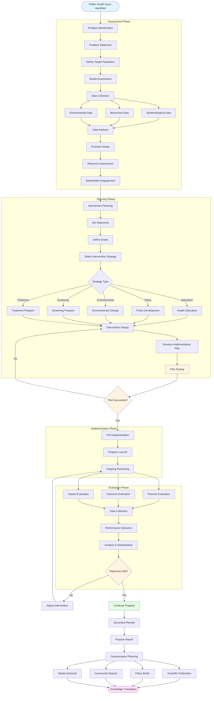

```mermaid
flowchart TD
    Start([Public Health Issue Identified]) --> A[Problem Identification]
    A --> B[Problem Statement]
    B --> C[Define Target Population]
    C --> D[Needs Assessment]
    D --> E[Data Collection]
    E --> F[Epidemiological Data]
    E --> G[Behavioral Data]
    E --> H[Environmental Data]
    F --> I[Data Analysis]
    G --> I
    H --> I
    I --> J[Prioritize Needs]
    J --> K[Resource Assessment]
    K --> L[Stakeholder Engagement]
    L --> M[Intervention Planning]
    M --> N[Set Objectives]
    N --> O[Define Goals]
    O --> P[Select Intervention Strategy]
    P --> Q{Strategy Type}
    Q -->|Education| R[Health Education]
    Q -->|Policy| S[Policy Development]
    Q -->|Environmental| T[Environmental Change]
    Q -->|Screening| U[Screening Program]
    Q -->|Treatment| V[Treatment Program]
    R --> W[Intervention Design]
    S --> W
    T --> W
    U --> W
    V --> W
    W --> X[Develop Implementation Plan]
    X --> Y[Pilot Testing]
    Y --> Z{Pilot Successful?}
    Z -->|No| W
    Z -->|Yes| AA[Full Implementation]
    AA --> BB[Program Launch]
    BB --> CC[Ongoing Monitoring]
    CC --> DD[Process Evaluation]
    CC --> EE[Outcome Evaluation]
    CC --> FF[Impact Evaluation]
    DD --> GG[Data Collection]
    EE --> GG
    FF --> GG
    GG --> HH[Performance Indicators]
    HH --> II[Analysis & Interpretation]
    II --> JJ{Objectives Met?}
    JJ -->|No| KK[Adjust Intervention]
    JJ -->|Yes| LL[Continue Program]
    KK --> CC
    LL --> MM[Document Results]
    MM --> NN[Prepare Report]
    NN --> OO[Dissemination Planning]
    OO --> PP[Scientific Publication]
    OO --> QQ[Policy Briefs]
    OO --> RR[Community Reports]
    OO --> SS[Media Outreach]
    PP --> End([Knowledge Translation])
    QQ --> End
    RR --> End
    SS --> End
    
    subgraph Assessment_Phase["Assessment Phase"]
        A
        B
        C
        D
        E
        F
        G
        H
        I
        J
        K
        L
    end
    
    subgraph Planning_Phase["Planning Phase"]
        M
        N
        O
        P
        Q
        R
        S
        T
        U
        V
        W
        X
        Y
    end
    
    subgraph Implementation_Phase["Implementation Phase"]
        AA
        BB
        CC
    end
    
    subgraph Evaluation_Phase["Evaluation Phase"]
        DD
        EE
        FF
        GG
        HH
        II
        JJ
    end
    
    style Start fill:#e1f5ff
    style End fill:#ffe1f5
    style Z fill:#fff4e1
    style JJ fill:#fff4e1
    style LL fill:#e1ffe1
    style Y fill:#fff4e1
```
